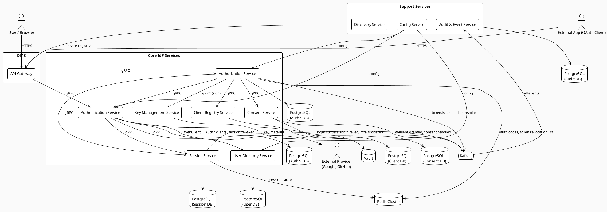
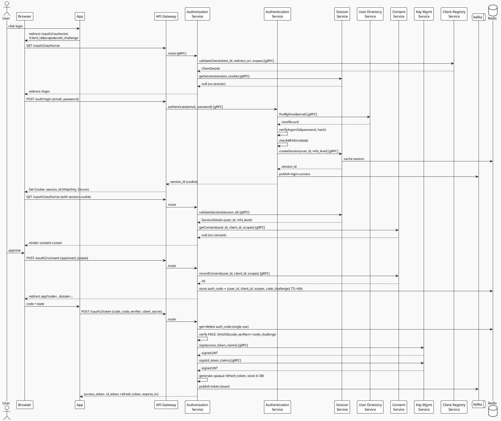
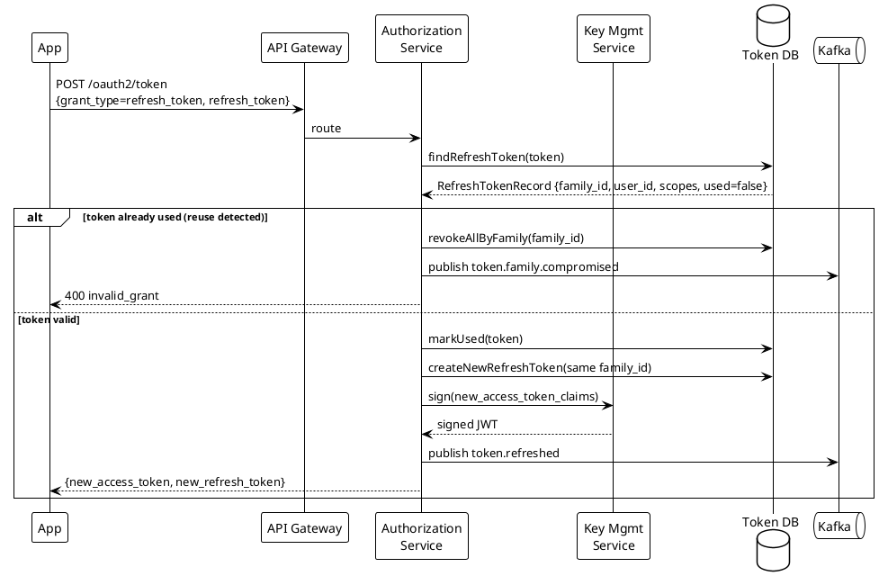
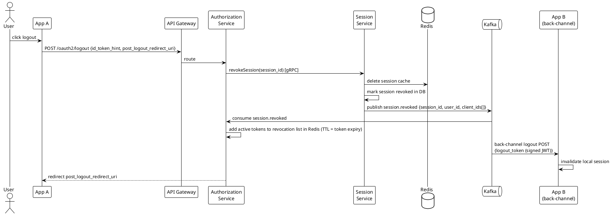

# Tolox IdP — Overall Architecture

---

## 1. Platform Vision

Tolox is an Ethiopian-first SSO-based ecosystem platform. One Central Identity Provider (IdP) authenticates all users once. Every app (ERP, social, customer-facing) is a registered OAuth 2.0 / OIDC client. No app handles passwords or sessions directly.

---

## 2. Services Overview

| Service | Role | Sync Protocol | Async |
|---|---|---|---|
| API Gateway | Single entry point, rate limiting, routing | gRPC / HTTP | — |
| Discovery Service | Service registry, health-aware routing | HTTP (Eureka) | — |
| Config Service | Centralized configuration | HTTP | — |
| Authorization Service | OAuth 2.0 flows, token issuance, PKCE | gRPC (internal) | Kafka producer |
| Authentication Service | Login, MFA, social login orchestration | gRPC (internal) | Kafka producer |
| User Directory Service | User identity, passwords, SCIM | gRPC (internal) | Kafka consumer |
| Client Registry Service | App/client registration, scope definitions | gRPC (internal) | — |
| Session Service | SSO sessions, logout propagation | gRPC (internal) | Kafka consumer/producer |
| Consent Service | Consent records, revocation | gRPC (internal) | Kafka producer |
| Key Management Service | Signing keys, JWKS, rotation | gRPC (internal) | — |
| Audit & Event Service | Append-only security event log | — | Kafka consumer |

---

## 3. Infrastructure Components

| Component | Purpose |
|---|---|
| PostgreSQL (per service) | Primary relational store — each service owns its own DB |
| Redis (shared cluster) | Sessions, authorization codes, token revocation list, rate limit counters |
| Kafka | Async event bus — audit events, session revocation fanout, notifications |
| Vault (HashiCorp) | Secrets — DB passwords, signing key material, provider client secrets |
| Internal CA | Issues mTLS certificates to every service |

---

## 4. High-Level Component Diagram



---

## 5. Full Use Case Flow — Login + Token Issuance (Authorization Code + PKCE)

This is the primary hot path. Every step is numbered and maps to a service.

```
1.  User visits App → App redirects to GET /oauth2/authorize
    Params: response_type=code, client_id, redirect_uri, scope, state, code_challenge, code_challenge_method=S256

2.  Gateway receives request → validates required params → routes to Authorization Service

3.  Authorization Service:
    a. Validates client_id exists → calls Client Registry Service (gRPC)
    b. Validates redirect_uri exact match against registered URIs
    c. Validates requested scopes are allowed for this client
    d. Stores code_challenge + code_challenge_method in Redis (key = session_id, TTL 10min)
    e. Checks if active SSO session exists → calls Session Service (gRPC)

4.  If no session → Authorization Service redirects to login UI
    Login UI POSTs credentials to POST /auth/login → Authentication Service

5.  Authentication Service:
    a. Looks up user by email → calls User Directory (gRPC)
    b. Verifies password hash (timing-safe, Argon2id)
    c. Checks account status (active/suspended/locked)
    d. If MFA enrolled → starts MFA flow (returns MFA challenge, not session yet)
    e. On MFA success → creates session → calls Session Service (gRPC)
    f. Publishes login.success or login.failed to Kafka

6.  Session Service creates session record:
    - session_id (UUID), user_id, auth_time, mfa_level, device_fingerprint
    - Stores in PostgreSQL + caches in Redis (TTL = session lifetime)
    - Returns session_id to Authentication Service

7.  Authentication Service returns session_id (as HttpOnly secure cookie) to browser

8.  Browser redirected back to Authorization Service with session cookie

9.  Authorization Service:
    a. Validates session via Session Service (gRPC)
    b. Checks existing consent → calls Consent Service (gRPC)
    c. If no consent → renders consent screen (scopes, app name, Amharic/English)
    d. User approves → Consent Service records consent
    e. Generates authorization_code (cryptographically random, 32 bytes, base64url)
    f. Stores code → {user_id, client_id, scopes, session_id, code_challenge, redirect_uri} in Redis (TTL 60s)
    g. Redirects to redirect_uri?code=...&state=...

10. App backend POSTs to /oauth2/token:
    Params: grant_type=authorization_code, code, redirect_uri, client_id, client_secret, code_verifier

11. Authorization Service token endpoint:
    a. Validates client credentials (client_id + client_secret, timing-safe)
    b. Retrieves code from Redis → validates it exists (single use: delete immediately)
    c. Verifies code_verifier: SHA256(code_verifier) == code_challenge (base64url)
    d. Verifies redirect_uri matches stored value exactly
    e. Calls Key Management Service (gRPC) to sign tokens
    f. Issues access token (JWT, RS256, 15min TTL)
    g. Issues ID token (JWT, RS256, contains user claims per requested scopes)
    h. Issues refresh token (opaque UUID, stored in DB with family_id, TTL 30 days)
    i. Publishes token.issued event to Kafka
    j. Returns token response JSON

12. Audit Service consumes all Kafka events → writes append-only audit records
```

---

## 6. Sequence Diagram — Full Login Flow



---

## 7. Sequence Diagram — Token Refresh + Rotation



---

## 8. Sequence Diagram — Global Logout



---

## 9. Service Communication Rules

| Call Type | Protocol | Auth |
|---|---|---|
| External client → Gateway | HTTPS | Client credentials / Bearer token |
| Gateway → any service | gRPC | mTLS + internal service JWT |
| Service → Service (sync) | gRPC | mTLS + internal service JWT |
| Service → external provider | WebClient (HTTPS) | Provider OAuth2 credentials (from Vault) |
| Service → Kafka | Kafka producer | mTLS (Kafka broker) |
| Kafka → Service | Kafka consumer | mTLS (Kafka broker) |
| Any service → Redis | Redis client | TLS + Redis AUTH |
| Any service → Vault | Vault client | AppRole auth |

---

## 10. Internal Service JWT Format

Every gRPC call between services carries this token in metadata header `x-internal-token`:

```json
{
  "iss": "tolox-internal",
  "sub": "authorization-service",
  "aud": "user-directory-service",
  "iat": 1700000000,
  "exp": 1700000060,
  "jti": "unique-per-call-uuid"
}
```

- Signed with a separate internal signing key (not the user-facing RS256 key)
- TTL: 60 seconds
- Issued by each service for each outbound call
- Target service validates `iss`, `aud` (must match its own service name), `exp`, and `jti` (prevent replay via Redis seen-jti cache)

---

## 11. Redis Key Namespaces

| Namespace | Content | TTL |
|---|---|---|
| `authcode:{code}` | auth code payload | 60s |
| `session:{session_id}` | session cache | session lifetime |
| `revoked_token:{jti}` | revoked token marker | token remaining TTL |
| `revoked_family:{family_id}` | compromised refresh token family | 30 days |
| `mfa_state:{session_id}` | in-progress MFA state machine | 5 min |
| `rate_limit:ip:{ip}` | failed attempt counter | rolling 15 min |
| `rate_limit:client:{client_id}` | client request counter | rolling 1 min |
| `seen_jti:{jti}` | internal token replay prevention | 65s |
| `pkce_challenge:{session_id}` | code_challenge during authorize flow | 10 min |

---

## 12. Kafka Topics

| Topic | Producer | Consumer | Payload |
|---|---|---|---|
| `tolox.auth.login` | Authentication Service | Audit Service | user_id, ip, device, success/fail, reason |
| `tolox.auth.mfa` | Authentication Service | Audit Service | user_id, mfa_type, success/fail |
| `tolox.token.issued` | Authorization Service | Audit Service | jti, user_id, client_id, scopes, expiry |
| `tolox.token.revoked` | Authorization Service | Audit Service | jti, reason |
| `tolox.token.family_compromised` | Authorization Service | Audit Service | family_id, user_id |
| `tolox.session.revoked` | Session Service | Authorization Service, Audit Service | session_id, user_id, client_ids |
| `tolox.consent.granted` | Consent Service | Audit Service | user_id, client_id, scopes |
| `tolox.consent.revoked` | Consent Service | Authorization Service, Audit Service | user_id, client_id |

---

## 13. Security Invariants (Cross-Cutting)

These apply to every service. No exceptions.

- Never log: passwords, tokens, authorization codes, client secrets. Log only IDs and hashes.
- All timestamps use UTC. Token `exp`/`iat`/`nbf` allow ±30s clock skew.
- All string comparisons of secrets use constant-time (`MessageDigest.isEqual`).
- All DB writes to security-sensitive tables are append-only or soft-delete only.
- Correlation ID (`X-Correlation-ID`) injected at Gateway, forwarded by every service in every log line and every downstream call.
- Every HTTP response that could leak information on error returns the same generic error shape — never expose internal service names, stack traces, or DB errors to external callers.
