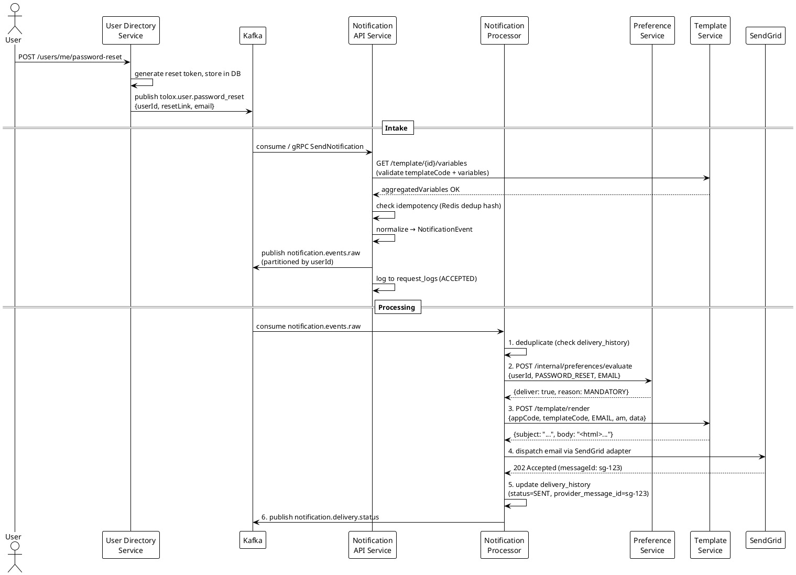
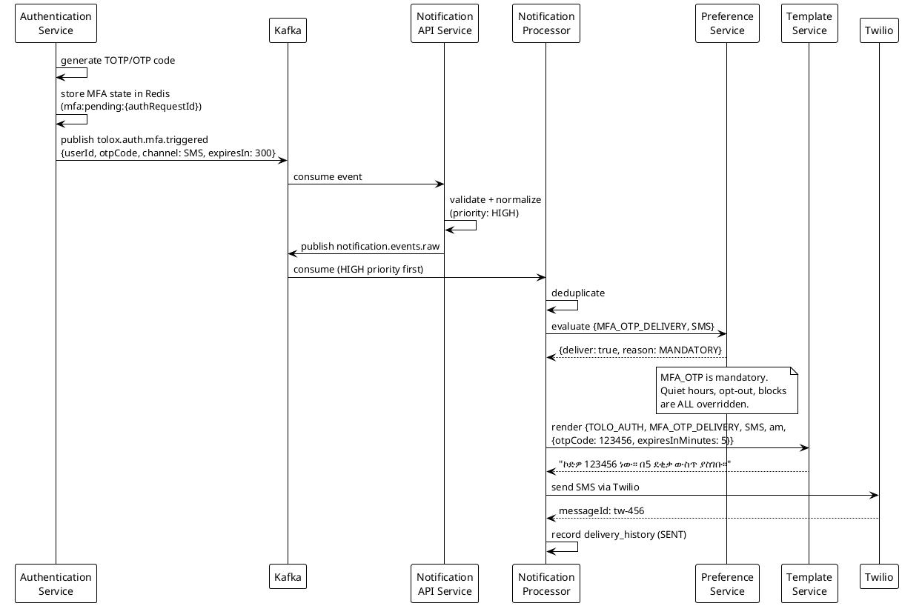
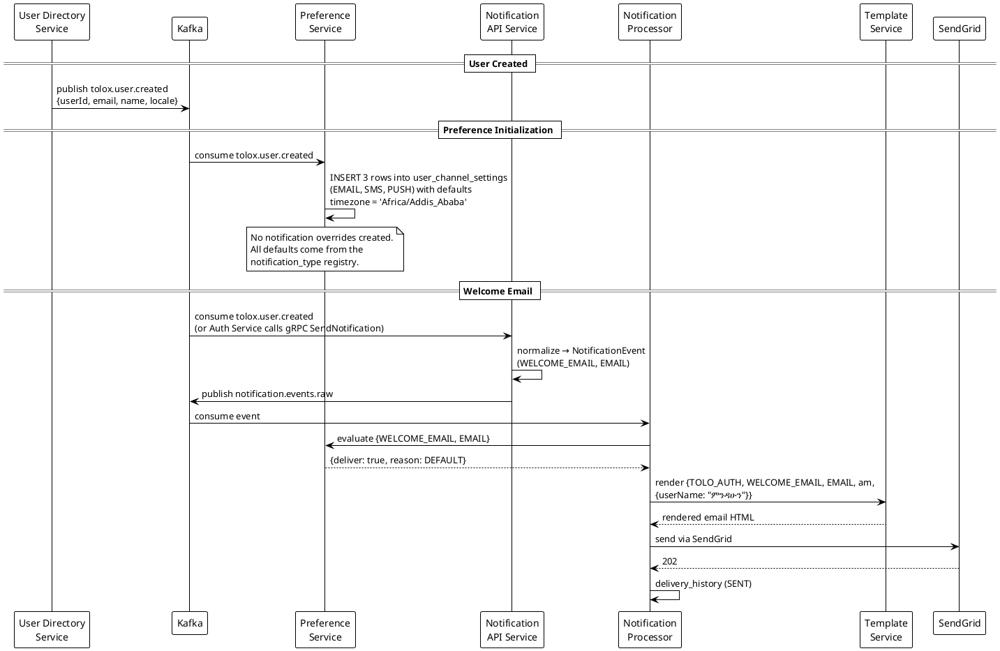
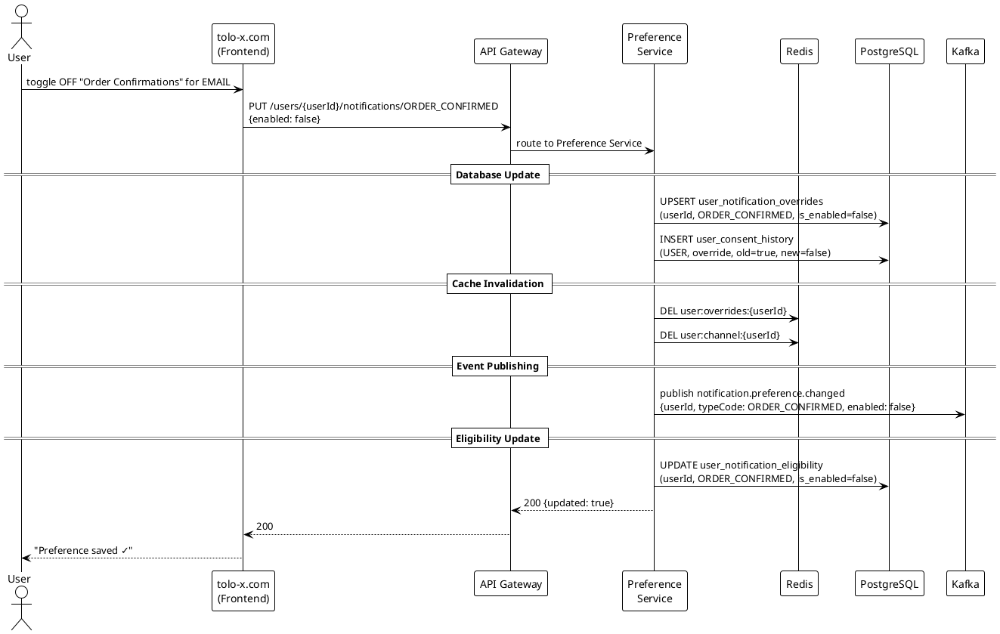
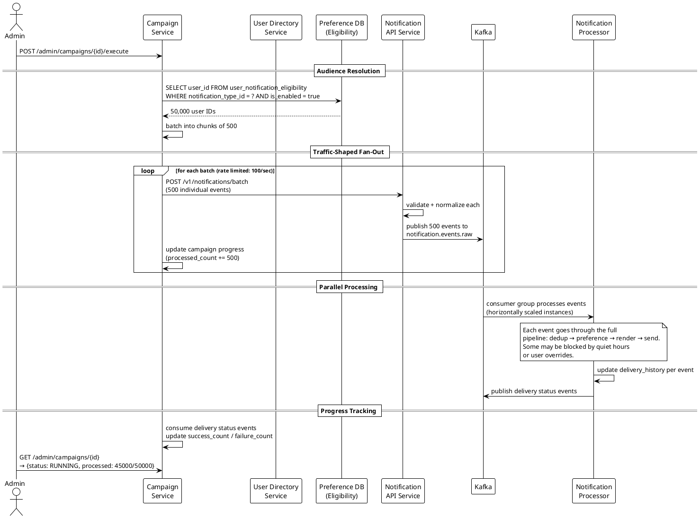
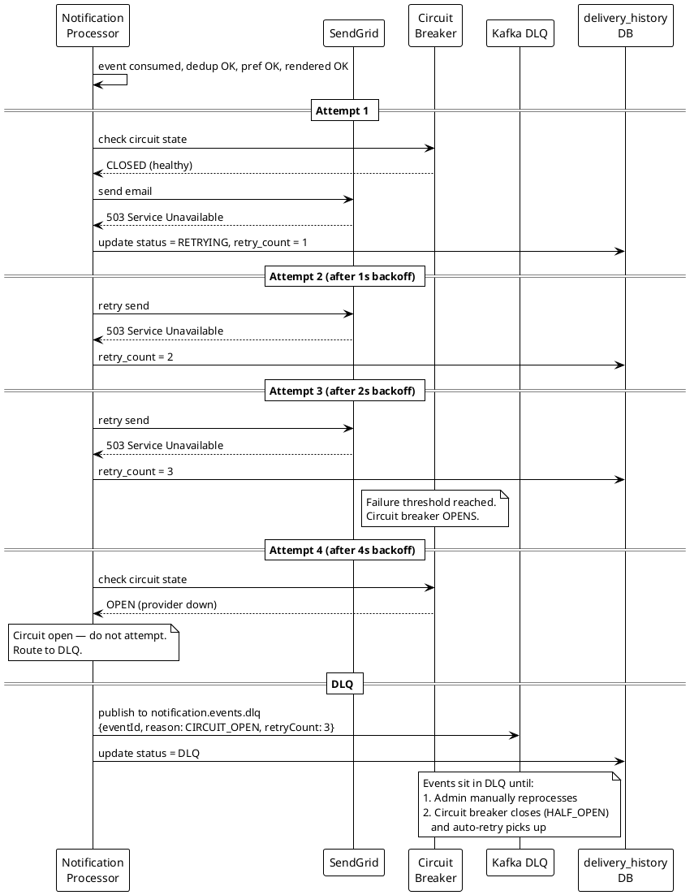
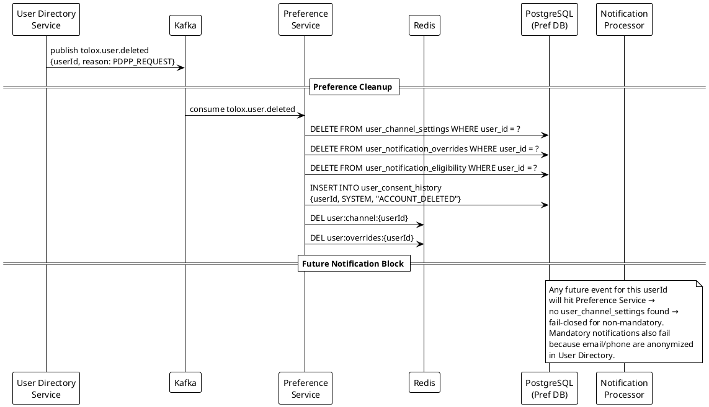
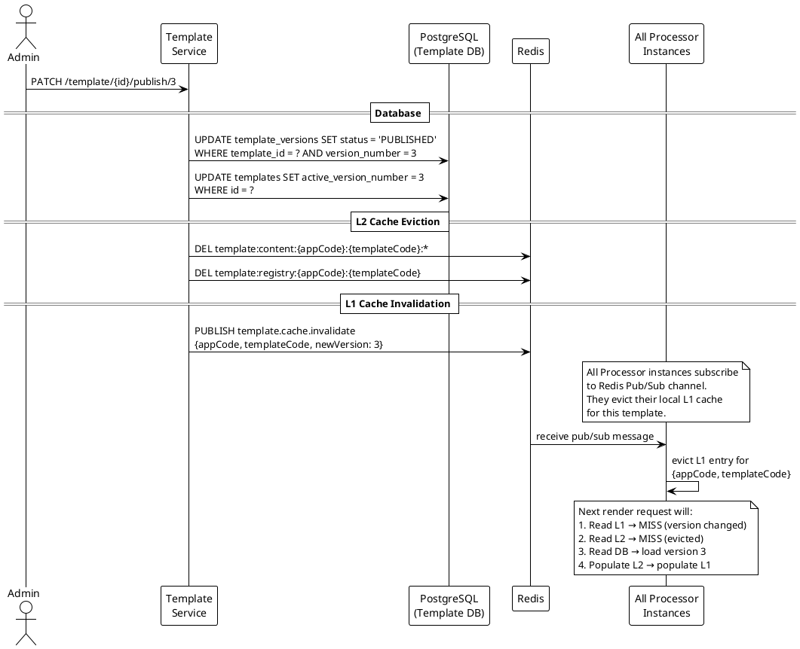

# Notification System — Flows & Sequence Diagrams

---

## 1. Transactional Notification Flow (e.g., Password Reset)

This is the primary flow — a platform service triggers a notification that reaches the user.

```
┌──────────┐     ┌──────────┐     ┌─────────┐     ┌───────────┐     ┌──────────┐     ┌──────────┐     ┌──────────┐
│  User     │     │  Auth    │     │ Kafka   │     │ Notif API │     │ Notif    │     │ Pref     │     │ Template │
│  Dir.     │     │ Service  │     │         │     │ Service   │     │ Processor│     │ Service  │     │ Service  │
│  Service  │     │          │     │         │     │           │     │          │     │          │     │          │
└────┬──────┘     └────┬─────┘     └────┬────┘     └─────┬─────┘     └────┬─────┘     └────┬─────┘     └────┬─────┘
     │                 │                │                 │                │                │                │
     │ user requests   │                │                 │                │                │                │
     │ password reset  │                │                 │                │                │                │
     ├────────────────>│                │                 │                │                │                │
     │                 │                │                 │                │                │                │
     │  generate token │                │                 │                │                │                │
     │  store in DB    │                │                 │                │                │                │
     │<────────────────┤                │                 │                │                │                │
     │                 │                │                 │                │                │                │
     │    publish tolox.user.password_reset               │                │                │                │
     │    to Kafka with user_id + reset_link              │                │                │                │
     ├───────────────────────────────-->│                 │                │                │                │
     │                 │                │                 │                │                │                │
     │                 │                │  Notif API      │                │                │                │
     │                 │                │  consumes OR    │                │                │                │
     │                 │                │  receives gRPC  │                │                │                │
     │                 │                ├────────────────>│                │                │                │
     │                 │                │                 │                │                │                │
     │                 │                │                 │ validate app   │                │                │
     │                 │                │                 │ + template     │                │                │
     │                 │                │                 ├───────────────────────────────────────────────-->│
     │                 │                │                 │<──────────────────────────────────────────────── │
     │                 │                │                 │                │                │                │
     │                 │                │                 │ check dedup    │                │                │
     │                 │                │                 │ (Redis)        │                │                │
     │                 │                │                 │                │                │                │
     │                 │                │                 │ normalize +    │                │                │
     │                 │                │                 │ publish to     │                │                │
     │                 │                │                 │ notification   │                │                │
     │                 │                │                 │ .events.raw    │                │                │
     │                 │                │<────────────────┤                │                │                │
     │                 │                │                 │                │                │                │
     │                 │                │ Processor       │                │                │                │
     │                 │                │ consumes event  │                │                │                │
     │                 │                ├────────────────────────────────>│                │                │
     │                 │                │                 │                │                │                │
     │                 │                │                 │                │ 1. check dedup │                │
     │                 │                │                 │                │    (delivery   │                │
     │                 │                │                 │                │     history)   │                │
     │                 │                │                 │                │                │                │
     │                 │                │                 │                │ 2. evaluate    │                │
     │                 │                │                 │                │    preference  │                │
     │                 │                │                 │                ├───────────────>│                │
     │                 │                │                 │                │                │                │
     │                 │                │                 │                │  is_mandatory  │                │
     │                 │                │                 │                │  = true        │                │
     │                 │                │                 │                │  → SEND        │                │
     │                 │                │                 │                │<───────────────┤                │
     │                 │                │                 │                │                │                │
     │                 │                │                 │                │ 3. render      │                │
     │                 │                │                 │                │    template    │                │
     │                 │                │                 │                ├───────────────────────────────>│
     │                 │                │                 │                │                │                │
     │                 │                │                 │                │  rendered HTML │                │
     │                 │                │                 │                │  + subject     │                │
     │                 │                │                 │                │<─────────────────────────────── │
     │                 │                │                 │                │                │                │
     │                 │                │                 │                │ 4. dispatch    │                │
     │                 │                │                 │                │    via SendGrid│                │
     │                 │                │                 │                │────────> [SendGrid]             │
     │                 │                │                 │                │<──────── 202 OK                 │
     │                 │                │                 │                │                │                │
     │                 │                │                 │                │ 5. record in   │                │
     │                 │                │                 │                │    delivery_   │                │
     │                 │                │                 │                │    history     │                │
     │                 │                │                 │                │                │                │
     │                 │                │                 │                │ 6. publish     │                │
     │                 │                │                 │                │    delivery    │                │
     │                 │                │                 │                │    status to   │                │
     │                 │                │                 │                │    Kafka       │                │
     │                 │                │<───────────────────────────────┤                │                │
     │                 │                │                 │                │                │                │
```

### PlantUML Sequence



---

## 2. MFA OTP Delivery Flow

Authentication Service triggers an SMS OTP during login. This is a **mandatory, high-priority** notification.



---

## 3. Preference Evaluation — Full Decision Tree

This shows every decision branch the Preference Service evaluates.

```
                          ┌─────────────────────┐
                          │  Evaluate Request    │
                          │  userId + typeCode   │
                          │  + channel + time    │
                          └──────────┬──────────┘
                                     │
                          ┌──────────▼──────────┐
                          │ Load notification_   │
                          │ type from L1 cache   │
                          └──────────┬──────────┘
                                     │
                          ┌──────────▼──────────┐
                     ┌────┤ is_mandatory = true? ├────┐
                     │YES └─────────────────────┘ NO  │
                     │                                 │
              ┌──────▼──────┐               ┌──────────▼──────────┐
              │  ✅ SEND     │               │ Load user_channel_  │
              │  (MANDATORY) │               │ settings from Redis │
              └─────────────┘               └──────────┬──────────┘
                                                       │
                                            ┌──────────▼──────────┐
                                       ┌────┤ legal_opt_out?      ├────┐
                                       │YES └─────────────────────┘ NO  │
                                       │                                │
                                ┌──────▼──────┐              ┌─────────▼─────────┐
                                │  ❌ BLOCK    │              │ is_blocked for    │
                                │  (LEGAL_     │         ┌────┤ this channel?     ├────┐
                                │   OPTOUT)    │         │YES └───────────────────┘ NO  │
                                └─────────────┘         │                               │
                                                 ┌──────▼──────┐             ┌──────────▼──────────┐
                                                 │  ❌ BLOCK    │             │ Is it quiet hours   │
                                                 │  (CHANNEL_   │        ┌────┤ for user timezone?  ├────┐
                                                 │   BLOCKED)   │        │YES └───────────────────── ┘ NO │
                                                 └─────────────┘        │                                │
                                                                 ┌──────▼──────┐          ┌──────────────▼────────┐
                                                                 │  ⏸️ DELAY   │          │ Load user_overrides   │
                                                                 │  (QUIET_    │          │ from Redis            │
                                                                 │   HOURS)    │     ┌────┤ override exists?      ├────┐
                                                                 └─────────────┘     │YES └───────────────────────┘ NO │
                                                                                     │                                │
                                                                              ┌──────▼──────┐          ┌──────────────▼────────┐
                                                                              │ Return      │          │ Check frequency       │
                                                                              │ override    │          │ counter in Redis      │
                                                                              │ .is_enabled │     ┌────┤ exceeded today?       ├────┐
                                                                              │ (USER_      │     │YES └───────────────────────┘ NO │
                                                                              │  OVERRIDE)  │     │                                │
                                                                              └─────────────┘     │                                │
                                                                                           ┌──────▼──────┐          ┌──────────────▼─────┐
                                                                                           │  ❌ BLOCK    │          │ Return default_    │
                                                                                           │  (FREQUENCY_ │          │ enabled from       │
                                                                                           │   LIMIT)     │          │ notification_type  │
                                                                                           └──────────────┘          │ (DEFAULT)          │
                                                                                                                     └────────────────────┘
```

---

## 4. User Registration — Preference Initialization + Welcome Email

When a new user registers, the User Directory Service triggers both preference setup and a welcome email.



---

## 5. User Changes Notification Preferences

Shows the cache invalidation chain when a user opts out of a notification type.



---

## 6. Campaign Execution Flow

Shows how a bulk campaign fans out into individual notifications without overwhelming the system.



---

## 7. Provider Failure — Retry + DLQ Flow

Shows what happens when an external provider (SendGrid, Twilio) fails.



---

## 8. User Deletion — PDPP Cascade

When a user exercises their right to deletion under PDPP, all notification preferences and history are cleaned.



---

## 9. Template Publishing — Cache Invalidation Chain



---

## 10. Notification Lifecycle Status Machine

Every notification transitions through these states:

```
                    ┌──────────┐
                    │ ACCEPTED │  (API Service logs request)
                    └────┬─────┘
                         │
                    ┌────▼─────┐
               ┌────┤ PENDING  ├────┐
               │    └──────────┘    │
               │                    │
          (preference              (preference
           = SEND)                  = BLOCK)
               │                    │
          ┌────▼─────┐        ┌────▼──────┐
          │ RENDERING│        │  BLOCKED  │  (terminal)
          └────┬─────┘        └───────────┘
               │
          ┌────▼─────┐
          │ RENDERED │
          └────┬─────┘
               │
          ┌────▼─────┐
     ┌────┤ SENDING  ├────┐
     │    └──────────┘    │
     │                    │
  (provider             (provider
   success)              failure)
     │                    │
┌────▼─────┐        ┌────▼──────┐
│   SENT   │        │ RETRYING  │
│(terminal)│        └────┬──────┘
└──────────┘             │
                    ┌────┴──────┐
               ┌────┤ max       ├────┐
               │    │ retries?  │    │
               │NO  └───────────┘ YES│
               │                     │
          (back to              ┌────▼─────┐
           SENDING)             │   DLQ    │  (terminal, manual intervention)
                                └──────────┘

                    ┌──────────┐
                    │  DELAYED │  (quiet hours → re-queue with delay)
                    └────┬─────┘
                         │
                    (after delay expires)
                         │
                    ┌────▼─────┐
                    │ PENDING  │  (re-enters pipeline)
                    └──────────┘
```

---

## 11. Cross-System Event Map

Complete map of all Kafka events flowing into and out of the Notification System.

```
╔══════════════════════════════════════════════════════════════════════════════╗
║                     INBOUND EVENTS (consumed by Notification System)       ║
╠══════════════════════════════╦═══════════════════════╦══════════════════════╣
║ Kafka Topic                  ║ Source Service         ║ Triggers             ║
╠══════════════════════════════╬═══════════════════════╬══════════════════════╣
║ tolox.auth.login.failed      ║ Authentication        ║ LOGIN_FAILED_ALERT   ║
║ tolox.auth.mfa.triggered     ║ Authentication        ║ MFA_OTP_DELIVERY     ║
║ tolox.auth.magic_link        ║ Authentication        ║ MAGIC_LINK           ║
║ tolox.user.created           ║ User Directory        ║ WELCOME_EMAIL +      ║
║                              ║                       ║ Preference init      ║
║ tolox.user.email_verification║ User Directory        ║ EMAIL_VERIFICATION   ║
║ tolox.user.password_reset    ║ User Directory        ║ PASSWORD_RESET       ║
║ tolox.user.password_changed  ║ User Directory        ║ PASSWORD_CHANGED_    ║
║                              ║                       ║ ALERT                ║
║ tolox.user.deleted           ║ User Directory        ║ Preference cleanup   ║
║ tolox.session.revoked        ║ Session Service       ║ SESSION_REVOKED_     ║
║                              ║                       ║ ALERT                ║
║ tolox.token.family_compromised║ Authorization        ║ TOKEN_COMPROMISE_    ║
║                              ║                       ║ ALERT                ║
║ tolox.consent.granted        ║ Consent Service       ║ CONSENT_CONFIRMATION ║
╠══════════════════════════════╩═══════════════════════╩══════════════════════╣
║                                                                            ║
║                     INTERNAL EVENTS (within Notification System)           ║
╠══════════════════════════════╦═══════════════════════╦══════════════════════╣
║ notification.events.raw      ║ Notification API      ║ → Processor          ║
║ notification.events.dlq      ║ Processor             ║ → Manual reprocess   ║
║ notification.delivery.status ║ Processor             ║ → Audit & Event Svc  ║
║ notification.preference.     ║ Preference Service    ║ → Processor (cache   ║
║   changed                    ║                       ║   invalidation)      ║
║ campaign.events.batch        ║ Campaign Service      ║ → Notification API   ║
╚══════════════════════════════╩═══════════════════════╩══════════════════════╝
```
