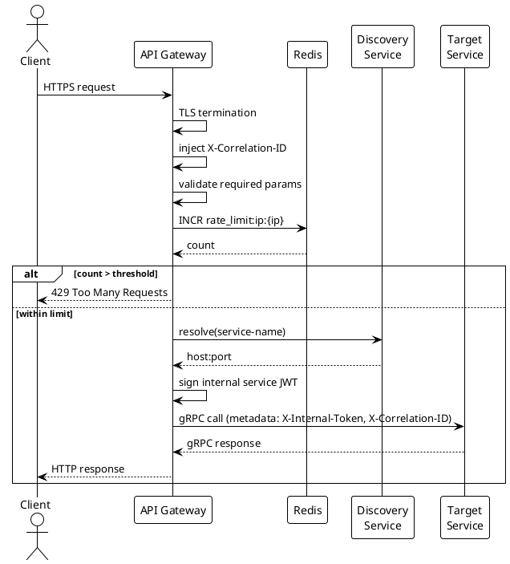

# Gateway, Discovery & Config Services

---

## API Gateway

### What to Implement

The gateway is the only entry point for all external traffic. Nothing reaches internal services without passing through it.

#### Schema / Configuration

```yaml
# Per-route config stored in Config Service
routes:
  - id: authorize
    path: /oauth2/authorize
    service: authorization-service
    methods: [GET]
    rate_limit: { per_ip: 20/min, per_client_id: 100/min }

  - id: token
    path: /oauth2/token
    service: authorization-service
    methods: [POST]
    rate_limit: { per_ip: 30/min, per_client_id: 200/min }

  - id: login
    path: /auth/login
    service: authentication-service
    methods: [POST]
    rate_limit: { per_ip: 10/min }

  - id: userinfo
    path: /oauth2/userinfo
    service: authorization-service
    methods: [GET, POST]
    rate_limit: { per_ip: 60/min }

  - id: revoke
    path: /oauth2/revoke
    service: authorization-service
    methods: [POST]

  - id: introspect
    path: /oauth2/introspect
    service: authorization-service
    methods: [POST]

  - id: jwks
    path: /.well-known/jwks.json
    service: key-management-service
    methods: [GET]
    cache_ttl: 300s

  - id: oidc_discovery
    path: /.well-known/openid-configuration
    service: authorization-service
    methods: [GET]
    cache_ttl: 3600s

# Internal service paths — never registered as external routes
internal_only:
  - user-directory-service
  - session-service
  - consent-service
  - client-registry-service
  - audit-event-service
  - key-management-service
```

#### Functionality in Detail

**Request pipeline (in order):**

1. TLS termination — all inbound is HTTPS, internal traffic is gRPC over mTLS
2. Correlation ID injection — generate UUID, attach as `X-Correlation-ID` header if not present
3. Request validation:
   - Content-Type must match method expectations (POST to /token must be `application/x-www-form-urlencoded`)
   - Required OAuth params present for known endpoints (missing `client_id` on /authorize → 400 before routing)
   - Max request body size enforced (1MB default, 10KB for token endpoint)
4. Rate limiting:
   - Per IP (sliding window, Redis-backed)
   - Per `client_id` extracted from query param or request body (not from token — token not yet validated here)
   - Per user (when session cookie present — extract session_id, rate limit on it)
   - Return `429 Too Many Requests` with `Retry-After` header
5. Route matching → resolve target service from Discovery Service
6. Internal service JWT generation — gateway signs a short-lived JWT for the downstream service
7. Forward via gRPC (inject internal token in gRPC metadata)
8. Response passthrough — gateway does not transform responses, only forwards

**What the gateway does NOT do:**
- It does not validate access tokens (that is the resource server's job via /introspect)
- It does not handle business logic
- It does not modify OAuth response bodies

#### Interfaces

**Consumes:**
- Discovery Service: resolve service name → host:port
- Config Service: route definitions, rate limit config
- Redis: rate limit counters, seen correlation IDs

**Provides to external callers:**
- All public HTTPS endpoints

#### API Contract

Gateway adds these headers to every forwarded request:

```
X-Correlation-ID: {uuid}
X-Forwarded-For: {client_ip}
X-Gateway-Version: 1
X-Internal-Token: {signed_service_jwt}
```

Gateway strips these from inbound requests (prevent spoofing):
```
X-Internal-Token
X-Forwarded-For (replace, never pass through)
```

#### Use Case Flow — Rate Limit Exceeded

```
1. Client POSTs to /oauth2/token
2. Gateway extracts client_id from body
3. Redis INCR rate_limit:client:{client_id} — returns 201
4. 201 > 200/min threshold
5. Gateway returns 429:
   {
     "error": "rate_limit_exceeded",
     "retry_after": 34
   }
6. Downstream service never called
```

#### Sequence Diagram



#### Functional Tests & Expected Results

| Test | Action | Expected Result |
|---|---|---|
| Missing client_id on /authorize | GET /oauth2/authorize without client_id | 400, `{"error":"invalid_request","error_description":"client_id required"}` |
| Rate limit — IP | 21 requests/min from same IP to /authorize | 21st returns 429 with Retry-After |
| Rate limit — client_id | 201 POST /token with same client_id in 1 min | 201st returns 429 |
| Internal route blocked | GET /internal/users directly | 404 (route not registered) |
| Correlation ID injected | Any request without X-Correlation-ID | Downstream receives X-Correlation-ID header |
| Correlation ID preserved | Request with X-Correlation-ID already set | Same ID forwarded, not replaced |
| X-Internal-Token stripped | Send X-Internal-Token in inbound request | Header not forwarded to downstream |
| Large body rejected | POST /token with 15KB body | 413 Request Entity Too Large |

#### Non-Functional Tests

| Test | Tool | Target |
|---|---|---|
| Latency overhead | k6 / Gatling | Gateway adds < 5ms p99 on top of service latency |
| Throughput | k6 | 5,000 req/s sustained with < 1% error rate |
| Rate limit accuracy under concurrency | k6 concurrent users | No more than threshold+5% requests pass during burst |
| Redis failure fallback | Kill Redis, run requests | Gateway degrades gracefully — either allow through or fail closed (configure per endpoint) |
| TLS cert expiry | certbot / monitoring alert | Alert 30 days before expiry |

#### Unit Tests

- `RateLimiter.shouldAllow(clientId, ip)` — test threshold boundary (N-1, N, N+1)
- `ParamValidator.validate(OAuthRequest)` — test all required/optional param combinations
- `CorrelationIdFilter` — test inject when absent, preserve when present
- `InternalTokenFilter` — test strip on inbound, inject on outbound

---

## Discovery Service

### What to Implement

Standard Spring Cloud Netflix Eureka server. No custom logic needed beyond configuration.

#### Functionality in Detail

- All services register on startup with: service name, host, port, health check URL
- Eureka runs heartbeat every 30s — deregisters services that miss 3 consecutive heartbeats
- Gateway queries Eureka on each routing decision (cached 30s locally)
- Self-preservation mode: if > 85% of services deregister in a short time (network partition), Eureka stops deregistering — prevents mass deregistration on network blip

#### Configuration

```yaml
eureka:
  server:
    enable-self-preservation: true
    eviction-interval-timer-in-ms: 5000
  instance:
    hostname: discovery-service
  client:
    register-with-eureka: false
    fetch-registry: false
```

Every other service registers as:
```yaml
eureka:
  client:
    service-url:
      defaultZone: http://discovery-service:8761/eureka/
  instance:
    prefer-ip-address: true
    instance-id: ${spring.application.name}:${spring.cloud.client.ip-address}:${server.port}
    lease-renewal-interval-in-seconds: 10
    lease-expiration-duration-in-seconds: 30
```

#### Functional Tests

| Test | Expected |
|---|---|
| Service registers on startup | Service visible in /eureka/apps/{service-name} |
| Service deregisters on shutdown | Removed from registry within 30s |
| Heartbeat miss x3 | Service removed from registry |
| Gateway resolves service | Returns correct host:port for registered service |
| Two instances of same service | Both visible, gateway load balances between them |

#### Non-Functional Tests

| Test | Target |
|---|---|
| Registry query latency | < 10ms p99 |
| Availability | Eureka stays up when 1 of 2 service instances go down (high availability pair) |

---

## Config Service

### What to Implement

Spring Cloud Config Server backed by a Git repository. All service configuration lives in Git. Secrets are references to Vault, not values.

#### Functionality in Detail

- Serves config by `{application}/{profile}` — e.g., `authorization-service/prod`
- Config refresh without restart: services use `@RefreshScope`, actuator `/actuator/refresh` triggers hot reload
- Encryption: Spring Cloud Config can encrypt sensitive values with `{cipher}` prefix — but prefer Vault references for secrets
- Git-backed: config changes go through pull request → audit trail built into Git history
- Profiles: `dev`, `staging`, `prod` — per-profile overrides

#### Directory Structure in Git

```
config-repo/
  application.yml              # shared by all services
  application-prod.yml         # shared prod overrides
  authorization-service.yml
  authorization-service-prod.yml
  authentication-service.yml
  user-directory-service.yml
  session-service.yml
  consent-service.yml
  key-management-service.yml
  client-registry-service.yml
  audit-event-service.yml
  gateway.yml
```

#### What Goes in Config vs Vault

| Config Service (Git) | Vault |
|---|---|
| Server ports, timeouts | DB passwords |
| Kafka topics, broker addresses | Redis AUTH password |
| Redis host/port | Signing key material |
| Token TTL values | Provider OAuth client secrets (Google, GitHub) |
| Rate limit thresholds | TeleBirr API keys |
| CORS allowed origins | Internal CA private key |
| Log levels | |

#### Functional Tests

| Test | Expected |
|---|---|
| Service fetches config on startup | Returns correct values for service+profile |
| Config update in Git | Service picks up change after /actuator/refresh call |
| Missing config key | Service fails fast at startup with clear error |
| Prod profile overrides dev | Prod values win over shared application.yml |
| Vault reference resolved | `${vault.db.password}` returns actual secret at runtime |

#### Non-Functional Tests

| Test | Target |
|---|---|
| Config fetch latency | < 100ms on startup |
| Config Service unavailable | Services that already started continue running with cached config |
| Git repo unavailable | Config Service returns last cached config from local clone |
