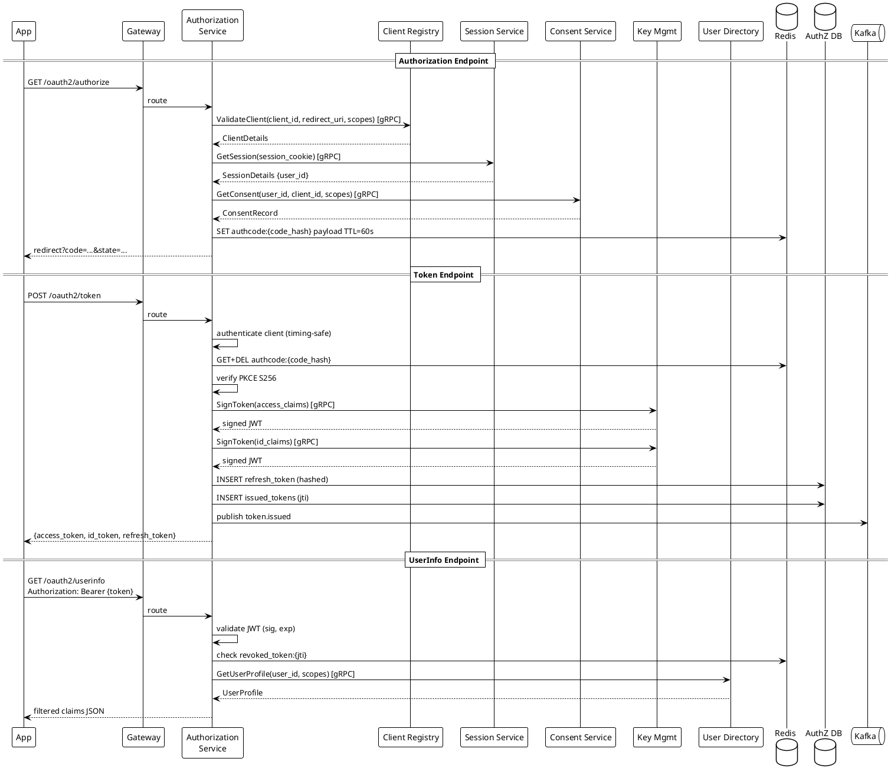

# Authorization Service

---

## What to Implement

The Authorization Service is the OAuth 2.0 / OIDC core. It owns the authorization code flow, token issuance, token lifecycle (refresh, revocation, introspection), PKCE enforcement, and the OIDC UserInfo endpoint. It is the single service that external OAuth clients interact with for all protocol operations.

---

## Schema

### PostgreSQL — authorization_db

```sql
-- Refresh tokens (access tokens are stateless JWTs, not stored)
CREATE TABLE refresh_tokens (
    id              UUID PRIMARY KEY DEFAULT gen_random_uuid(),
    token_hash      VARCHAR(64) NOT NULL UNIQUE,  -- SHA256 of opaque token, never store raw
    family_id       UUID NOT NULL,                -- rotation family tracking
    user_id         UUID NOT NULL,
    client_id       VARCHAR(100) NOT NULL,
    scopes          TEXT NOT NULL,                -- space-separated
    session_id      UUID NOT NULL,
    issued_at       TIMESTAMPTZ NOT NULL DEFAULT NOW(),
    expires_at      TIMESTAMPTZ NOT NULL,
    used_at         TIMESTAMPTZ,                  -- null = not yet used
    revoked_at      TIMESTAMPTZ,
    revoke_reason   VARCHAR(50),
    CONSTRAINT valid_state CHECK (
        NOT (used_at IS NOT NULL AND revoked_at IS NOT NULL)
    )
);

CREATE INDEX idx_refresh_tokens_family ON refresh_tokens(family_id);
CREATE INDEX idx_refresh_tokens_user ON refresh_tokens(user_id);
CREATE INDEX idx_refresh_tokens_expires ON refresh_tokens(expires_at);

-- Token families (for revocation tracking)
CREATE TABLE token_families (
    id              UUID PRIMARY KEY DEFAULT gen_random_uuid(),
    user_id         UUID NOT NULL,
    client_id       VARCHAR(100) NOT NULL,
    created_at      TIMESTAMPTZ NOT NULL DEFAULT NOW(),
    compromised_at  TIMESTAMPTZ,
    compromised_reason VARCHAR(100)
);

-- Issued token audit (lightweight — full audit in Audit Service)
-- Only stores jti for revocation lookup. Not full token.
CREATE TABLE issued_tokens (
    jti             UUID PRIMARY KEY,
    user_id         UUID NOT NULL,
    client_id       VARCHAR(100) NOT NULL,
    scopes          TEXT NOT NULL,
    issued_at       TIMESTAMPTZ NOT NULL,
    expires_at      TIMESTAMPTZ NOT NULL,
    token_type      VARCHAR(20) NOT NULL  -- 'access' | 'id'
);

CREATE INDEX idx_issued_tokens_user ON issued_tokens(user_id);
CREATE INDEX idx_issued_tokens_expires ON issued_tokens(expires_at);
```

### Redis Keys (Authorization Service Owned)

```
authcode:{code_hash}     → JSON{user_id, client_id, scopes, session_id, code_challenge, redirect_uri, created_at}   TTL: 60s
revoked_token:{jti}      → "1"   TTL: remaining token lifetime
revoked_family:{family}  → "1"   TTL: 30d
```

---

## Functionality in Detail

### 1. Authorization Endpoint — GET /oauth2/authorize

**Receives:** `response_type`, `client_id`, `redirect_uri`, `scope`, `state`, `code_challenge`, `code_challenge_method`, optional `nonce`, `prompt`, `max_age`

**Steps:**
1. Validate `response_type=code` — reject implicit (`token`) and hybrid flows
2. Validate `client_id` exists and is active — call Client Registry via gRPC
3. Validate `redirect_uri` — exact string match against all registered URIs for client. If no match → error page (do NOT redirect — attacker controls redirect_uri)
4. Validate `scope` — every requested scope must be in the client's allowed scopes
5. Validate `code_challenge_method=S256` — reject `plain` method
6. Validate `code_challenge` is present and valid base64url, 43-128 chars
7. Check active session — call Session Service via gRPC with session cookie
8. If no session or `prompt=login` → redirect to login UI preserving all params
9. If session exists and `max_age` specified → check session age. If older than max_age → force re-auth
10. If session exists → check consent. Call Consent Service via gRPC
11. If no consent or `prompt=consent` → render consent screen
12. If consent exists → generate authorization code:
    - `code = base64url(secureRandom(32 bytes))`
    - `code_hash = SHA256(code)`
    - Store in Redis: key=`authcode:{code_hash}`, value=JSON payload, TTL=60s
13. Redirect to `redirect_uri?code={code}&state={state}`

**Error handling:**
- Invalid client_id → render error page (no redirect)
- Invalid redirect_uri → render error page (no redirect)
- Invalid scope → redirect with `error=invalid_scope`
- Missing code_challenge → redirect with `error=invalid_request`
- User denies consent → redirect with `error=access_denied`

### 2. Token Endpoint — POST /oauth2/token

**Content-Type:** `application/x-www-form-urlencoded`

**Supported grant_types:**
- `authorization_code`
- `refresh_token`
- `client_credentials` (for machine-to-machine)

#### authorization_code grant

**Receives:** `grant_type`, `code`, `redirect_uri`, `client_id`, `client_secret`, `code_verifier`

1. Authenticate client: validate `client_id` + `client_secret` (timing-safe hash comparison). For public clients, skip secret, require PKCE.
2. `code_hash = SHA256(code)` → look up in Redis → returns payload. If not found → `invalid_grant`.
3. **Delete from Redis immediately** (single-use enforcement) before any further processing.
4. Verify `redirect_uri` matches stored value exactly.
5. Verify PKCE: `base64url(SHA256(code_verifier)) == stored code_challenge`. Reject if mismatch.
6. Verify code is not expired (should be impossible if Redis TTL worked, but check anyway).
7. Call Key Management Service (gRPC) to sign access token + ID token.
8. Build access token claims:
   ```json
   {
     "iss": "https://idp.tolox.io",
     "sub": "{user_id}",
     "aud": "{client_id}",
     "exp": now + 900,
     "iat": now,
     "jti": "{uuid}",
     "scope": "{granted_scopes}",
     "sid": "{session_id}"
   }
   ```
9. Build ID token claims (only include claims for requested scopes):
   ```json
   {
     "iss": "https://idp.tolox.io",
     "sub": "{user_id}",
     "aud": "{client_id}",
     "exp": now + 900,
     "iat": now,
     "auth_time": "{session_auth_time}",
     "nonce": "{if_provided}",
     "amr": ["pwd", "otp"],
     "name": "...",
     "email": "...",
     "locale": "am-ET"
   }
   ```
10. Generate opaque refresh token: `token = base64url(secureRandom(32))`, store hashed with new `family_id`.
11. Store `jti` in `issued_tokens` table.
12. Publish `token.issued` event to Kafka.
13. Return:
    ```json
    {
      "access_token": "...",
      "token_type": "Bearer",
      "expires_in": 900,
      "refresh_token": "...",
      "id_token": "...",
      "scope": "openid profile email"
    }
    ```

#### refresh_token grant

1. Authenticate client (same as above).
2. Look up refresh token by `SHA256(token)` in DB.
3. If not found → `invalid_grant`.
4. If `revoked_at` is set → `invalid_grant`.
5. If `used_at` is set → **reuse detected**:
   - Mark entire family as compromised in `token_families`
   - Revoke all tokens in family (set `revoked_at`)
   - Publish `token.family_compromised` to Kafka
   - Return `invalid_grant`
6. Mark current token as `used_at = now`.
7. Issue new refresh token in same family.
8. Issue new access token (sign via KMS).
9. Return new tokens.

#### client_credentials grant

For machine-to-machine. No user context, no refresh token, no ID token.

1. Authenticate client with client_id + client_secret.
2. Verify client is allowed to use `client_credentials` grant type.
3. Validate requested scopes are machine-scoped (e.g., `ai:query:erp`).
4. Issue access token with `sub = client_id` (no user).
5. No refresh token issued.

### 3. Token Revocation — POST /oauth2/revoke

Per RFC 7009.

1. Authenticate client.
2. Accept `token` + optional `token_type_hint`.
3. If token is a refresh token: look up by hash → mark `revoked_at`.
4. If token is an access token (JWT): extract `jti` from JWT, add to Redis revocation list with TTL = token remaining lifetime.
5. Trigger back-channel logout if `token_type_hint=refresh_token` (session may still be valid — don't auto-logout unless requested).
6. Always return 200 (even if token not found — RFC requirement).

### 4. Token Introspection — POST /oauth2/introspect

For resource servers to validate opaque tokens or verify JWT claims server-side.

1. Authenticate caller (must be a registered resource server or client).
2. If JWT: validate signature using JWKS from KMS, check `exp`, check revocation list in Redis.
3. If opaque token (refresh token): look up in DB.
4. Return RFC 7662 response:
   ```json
   {
     "active": true,
     "sub": "{user_id}",
     "scope": "openid profile",
     "client_id": "my-app",
     "exp": 1700000900,
     "iat": 1700000000,
     "jti": "...",
     "token_type": "Bearer"
   }
   ```
5. If invalid/expired/revoked → `{"active": false}` (no other fields).

### 5. UserInfo Endpoint — GET /oauth2/userinfo

1. Extract Bearer token from Authorization header.
2. Validate JWT (signature, expiry, revocation).
3. Extract `sub` (user_id) and `scope` from token.
4. Call User Directory (gRPC) to fetch user profile.
5. Filter claims to only those covered by granted scopes.
6. Return claims as JSON (or JWT if client registered `userinfo_signed_response_alg`).

### 6. OIDC Discovery — GET /.well-known/openid-configuration

Returns static metadata:
```json
{
  "issuer": "https://idp.tolox.io",
  "authorization_endpoint": "https://idp.tolox.io/oauth2/authorize",
  "token_endpoint": "https://idp.tolox.io/oauth2/token",
  "userinfo_endpoint": "https://idp.tolox.io/oauth2/userinfo",
  "jwks_uri": "https://idp.tolox.io/.well-known/jwks.json",
  "revocation_endpoint": "https://idp.tolox.io/oauth2/revoke",
  "introspection_endpoint": "https://idp.tolox.io/oauth2/introspect",
  "scopes_supported": ["openid", "profile", "email", "phone", "address", "ai:query:erp"],
  "response_types_supported": ["code"],
  "grant_types_supported": ["authorization_code", "refresh_token", "client_credentials"],
  "subject_types_supported": ["public"],
  "id_token_signing_alg_values_supported": ["RS256"],
  "code_challenge_methods_supported": ["S256"],
  "token_endpoint_auth_methods_supported": ["client_secret_post", "client_secret_basic", "none"]
}
```

---

## Interfaces

### Consumes (gRPC — outbound calls)

| Service | Method | When |
|---|---|---|
| Client Registry | `ValidateClient(client_id, redirect_uri, scopes)` | Every /authorize request |
| Session Service | `GetSession(session_id)` | Every /authorize request |
| Consent Service | `GetConsent(user_id, client_id, scopes)` | Every /authorize after session validated |
| Consent Service | `RecordConsent(user_id, client_id, scopes)` | After user approves consent screen |
| Key Management | `SignToken(claims, key_type)` | Every token issuance |
| User Directory | `GetUserProfile(user_id, scopes)` | /userinfo endpoint |

### Consumes (Kafka — inbound)

| Topic | Action |
|---|---|
| `tolox.session.revoked` | Add all tokens for session to revocation list in Redis |
| `tolox.consent.revoked` | Revoke all active tokens for user+client |

### Provides (gRPC — for other services)

Not applicable — Authorization Service is only called by Gateway (HTTP), not by other internal services via gRPC.

### Provides (Kafka — outbound)

| Topic | When |
|---|---|
| `tolox.token.issued` | Every successful token issuance |
| `tolox.token.revoked` | Every revocation |
| `tolox.token.family_compromised` | Refresh token reuse detected |

---

## Detailed Use Case Flows

### Edge Case: Authorization Code Reuse Attack

```
1. Attacker intercepts code during redirect
2. Attacker submits code to /token before legitimate app
3. First submission: code found in Redis, deleted, tokens issued (attacker gets tokens)
4. Second submission (legitimate app): code not found in Redis → invalid_grant
5. App sees error → should treat as possible compromise, prompt re-login
NOTE: If legitimate app gets there first, attacker gets nothing.
The real fix is PKCE — attacker without code_verifier can't complete exchange even with code.
```

### Edge Case: PKCE code_verifier Mismatch

```
1. Client sends code_challenge at /authorize
2. Attacker intercepts auth code
3. Attacker calls /token with code but wrong code_verifier
4. SHA256(wrong_verifier) != stored code_challenge
5. Return invalid_grant, do NOT issue tokens
6. Code is already consumed from Redis (deleted on first lookup)
7. Legitimate app also can't use code anymore → re-auth required
```

### Edge Case: Expired Authorization Code

```
1. User approves consent at T=0
2. code stored in Redis with TTL=60s
3. App doesn't call /token until T=65s (network issue)
4. Redis key expired → code not found → invalid_grant
5. App must restart authorization flow
```

### Edge Case: Concurrent Refresh Token Use

```
1. App has refresh_token RT1 (family F1)
2. Two parallel requests both send RT1 to /token
3. First request: DB lookup finds RT1 unused → marks used_at, issues RT2
4. Second request: DB lookup finds RT1 with used_at set → reuse detected
5. Mark family F1 compromised
6. Revoke RT1 and RT2
7. Both requests return invalid_grant
8. User must re-authenticate
```

---

## Sequence Diagram



---

## Functional Tests & Expected Results

| Test | Action | Expected |
|---|---|---|
| Valid authorization code flow | Full PKCE flow with valid params | 200 token response with access_token, id_token, refresh_token |
| Missing code_challenge | /authorize without code_challenge | Redirect with `error=invalid_request` |
| Wrong redirect_uri | /authorize with unregistered redirect_uri | Error page rendered, no redirect |
| Code reuse | Submit same code twice to /token | First: tokens issued. Second: `invalid_grant` |
| PKCE mismatch | Wrong code_verifier at /token | `invalid_grant` |
| Expired code | Wait 61s before /token | `invalid_grant` |
| Refresh token rotation | Use valid refresh token | New access + refresh token returned, old refresh token marked used |
| Refresh token reuse | Submit used refresh token | `invalid_grant`, entire family revoked |
| Token revocation | POST /oauth2/revoke with access token | 200 returned. Subsequent introspection returns `active: false` |
| Introspection — valid | POST /introspect with valid JWT | `active: true` with claims |
| Introspection — expired | POST /introspect with expired JWT | `active: false` |
| Introspection — revoked | Revoke token, then introspect | `active: false` |
| UserInfo — valid scope | GET /userinfo, token has `email` scope | Returns email claim |
| UserInfo — scope not granted | GET /userinfo, token has no `profile` scope | Returns claims without profile fields |
| client_credentials grant | Machine client calls /token | Access token with no user sub, no refresh token |
| Implicit flow attempt | response_type=token | 400 unsupported_response_type |

---

## Non-Functional Tests

| Test | Tool | Target |
|---|---|---|
| Token issuance latency | k6 | p50 < 50ms, p99 < 200ms end-to-end |
| Throughput | k6 | 1,000 token issuances/sec sustained |
| Redis unavailable | Kill Redis | /authorize fails fast (500), /token fails fast. No silent fallback. |
| KMS unavailable | Kill KMS | Token issuance fails with 500. No tokens issued with local key. |
| DB unavailable | Kill AuthZ DB | Refresh token grant fails (500). Authorization code flow degrades (no refresh token) |
| Concurrent refresh token | 100 concurrent requests same refresh token | Exactly one succeeds, rest get invalid_grant, family revoked |
| Memory under load | Heap profiling | No memory leak over 1 hour sustained load |

---

## Unit Tests

```java
// PKCE verification
@Test void verifyPKCE_validVerifier_shouldPass()
@Test void verifyPKCE_wrongVerifier_shouldFail()
@Test void verifyPKCE_plainMethod_shouldReject()
@Test void verifyPKCE_shortVerifier_shouldFail() // < 43 chars

// Code generation
@Test void authCode_isBase64Url_andCorrectLength()
@Test void authCode_twoCallsProduceDifferentCodes()

// Token claims builder
@Test void accessToken_containsRequiredClaims()
@Test void idToken_onlyContainsScopeFilteredClaims()
@Test void idToken_withNonce_containsNonce()
@Test void idToken_withoutNonce_doesNotContainNonce()

// Refresh token rotation
@Test void refreshToken_usedToken_triggersReuse()
@Test void refreshToken_newTokenHasSameFamilyId()
@Test void refreshToken_compromisedFamily_revokesAll()

// Scope validation
@Test void scopeValidation_unknownScope_rejects()
@Test void scopeValidation_disallowedScopeForClient_rejects()
@Test void scopeValidation_subsetOfAllowed_passes()

// Redirect URI
@Test void redirectUri_exactMatch_passes()
@Test void redirectUri_prefixMatch_fails()
@Test void redirectUri_caseInsensitive_fails() // must be exact byte match
@Test void redirectUri_trailingSlashDifference_fails()
```

---

## Additional Considerations

**Token signing algorithm:** Use RS256 (RSA + SHA256). ES256 (ECDSA) is more efficient but RS256 has broader library support across client languages — important for Ethiopian developers building on Tolox.

**Clock skew:** Accept tokens where `nbf` is up to 30 seconds in the future. Reject tokens where `exp` is more than 30 seconds in the past.

**Scope design for Tolox:**

```
openid          — required for OIDC, enables ID token
profile         — name, locale, picture
email           — email address, email_verified
phone           — phone_number
address         — physical address
erp:read        — read access to ERP data
erp:write       — write access to ERP data
ai:query:erp    — AI agent can query ERP data on user's behalf
ai:summarize    — AI agent can summarize user data
```

**Token size:** Keep access tokens lean. Do not embed large claims (e.g., full user profile, role lists). Resource servers should call UserInfo or their own user lookup if they need more. Fat tokens create performance problems at scale.
