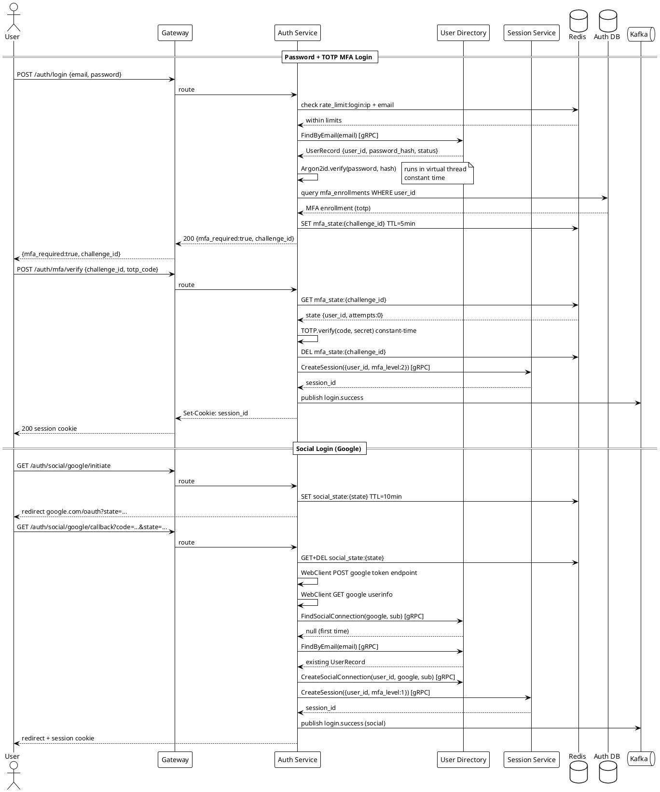

# Authentication Service

---

## What to Implement

The Authentication Service owns everything related to proving a user's identity. This includes password verification, MFA orchestration, social login (Tolox as OAuth2 client to Google/GitHub/Facebook), passwordless flows, brute-force protection, and session creation hand-off to Session Service. It never issues OAuth tokens — that is Authorization Service's job. It only creates authenticated sessions.

---

## Schema

### PostgreSQL — authentication_db

```sql
-- MFA enrollment per user
CREATE TABLE mfa_enrollments (
    id              UUID PRIMARY KEY DEFAULT gen_random_uuid(),
    user_id         UUID NOT NULL,
    mfa_type        VARCHAR(20) NOT NULL,  -- 'totp' | 'sms' | 'email'
    secret_encrypted TEXT NOT NULL,        -- encrypted TOTP secret or masked phone/email
    is_primary      BOOLEAN NOT NULL DEFAULT false,
    enrolled_at     TIMESTAMPTZ NOT NULL DEFAULT NOW(),
    last_used_at    TIMESTAMPTZ,
    revoked_at      TIMESTAMPTZ,
    CONSTRAINT unique_primary_per_user UNIQUE (user_id, is_primary) DEFERRABLE
);

CREATE INDEX idx_mfa_user ON mfa_enrollments(user_id);

-- Brute force tracking
CREATE TABLE login_attempts (
    id              UUID PRIMARY KEY DEFAULT gen_random_uuid(),
    identifier      VARCHAR(255) NOT NULL,  -- email or IP
    identifier_type VARCHAR(10) NOT NULL,   -- 'email' | 'ip'
    attempted_at    TIMESTAMPTZ NOT NULL DEFAULT NOW(),
    success         BOOLEAN NOT NULL,
    ip_address      INET NOT NULL,
    user_agent      TEXT,
    country_code    VARCHAR(2)
);

CREATE INDEX idx_attempts_identifier ON login_attempts(identifier, attempted_at DESC);

-- Account lockouts
CREATE TABLE account_lockouts (
    user_id         UUID PRIMARY KEY,
    locked_at       TIMESTAMPTZ NOT NULL DEFAULT NOW(),
    unlock_at       TIMESTAMPTZ NOT NULL,
    reason          VARCHAR(100) NOT NULL,
    lock_count      INT NOT NULL DEFAULT 1  -- escalating lockout duration
);

-- Magic links (passwordless)
CREATE TABLE magic_links (
    id              UUID PRIMARY KEY DEFAULT gen_random_uuid(),
    token_hash      VARCHAR(64) NOT NULL UNIQUE,
    user_id         UUID NOT NULL,
    email           VARCHAR(255) NOT NULL,
    created_at      TIMESTAMPTZ NOT NULL DEFAULT NOW(),
    expires_at      TIMESTAMPTZ NOT NULL,
    used_at         TIMESTAMPTZ,
    ip_requested    INET
);

CREATE INDEX idx_magic_links_expires ON magic_links(expires_at);

-- Social login connections (external provider → Tolox user)
CREATE TABLE social_connections (
    id              UUID PRIMARY KEY DEFAULT gen_random_uuid(),
    user_id         UUID NOT NULL,
    provider        VARCHAR(30) NOT NULL,   -- 'google' | 'github' | 'facebook'
    provider_subject VARCHAR(255) NOT NULL, -- provider's user ID (stable, not email)
    provider_email  VARCHAR(255),
    connected_at    TIMESTAMPTZ NOT NULL DEFAULT NOW(),
    last_used_at    TIMESTAMPTZ,
    CONSTRAINT unique_provider_subject UNIQUE (provider, provider_subject)
);

CREATE INDEX idx_social_user ON social_connections(user_id);

-- Remembered devices (for MFA skip on trusted devices)
CREATE TABLE trusted_devices (
    id              UUID PRIMARY KEY DEFAULT gen_random_uuid(),
    user_id         UUID NOT NULL,
    device_fingerprint VARCHAR(64) NOT NULL,  -- SHA256 of UA+IP+other signals
    device_name     VARCHAR(100),
    trusted_at      TIMESTAMPTZ NOT NULL DEFAULT NOW(),
    expires_at      TIMESTAMPTZ NOT NULL,
    last_seen_at    TIMESTAMPTZ,
    revoked_at      TIMESTAMPTZ
);

CREATE INDEX idx_trusted_devices_user ON trusted_devices(user_id);
```

### Redis Keys (Authentication Service Owned)

```
mfa_state:{challenge_id}   → JSON{user_id, mfa_type, code_hash, attempts, step}   TTL: 5min
rate_limit:login:ip:{ip}   → attempt count   TTL: 15min rolling
rate_limit:login:email:{email_hash} → attempt count   TTL: 15min rolling
social_state:{state}       → JSON{provider, redirect_uri, code_challenge, original_params}   TTL: 10min
```

---

## Functionality in Detail

### 1. Password Login — POST /auth/login

**Receives:** `email`, `password`, session context from gateway (IP, User-Agent)

1. Rate limit check — Redis: `rate_limit:login:ip:{ip}` and `rate_limit:login:email:{SHA256(email)}`
   - IP limit: 10 attempts / 15min
   - Email limit: 5 attempts / 15min
   - If exceeded → return same 401 response as wrong password (do not distinguish)
2. Look up user by email → User Directory gRPC call `FindByEmail(email)`
   - If user not found → **still perform dummy password verify** (constant-time fake compare to prevent timing oracle). Return 401 with `{"error":"invalid_credentials"}` — same response as wrong password.
3. Verify password: `Argon2id.verify(input_password, stored_hash)` — blocking, run in virtual thread
4. Check account status → User Directory returns status. If `SUSPENDED` or `DELETED` → return 401 `{"error":"account_disabled"}`
5. Check lockout: query `account_lockouts` by `user_id`. If `unlock_at > now` → return 401 `{"error":"account_locked","unlock_at":"..."}`
6. On wrong password:
   - Increment Redis counters
   - INSERT into `login_attempts` (success=false)
   - Count recent failures from `login_attempts` for this user
   - If ≥ 5 failures in 15min → INSERT/UPDATE `account_lockouts` (escalating: 5min, 30min, 2hr, 24hr)
   - Return 401
7. On correct password:
   - Reset Redis rate limit counters for this email
   - INSERT `login_attempts` (success=true)
   - Check MFA enrollment → query `mfa_enrollments` where `user_id AND revoked_at IS NULL`
   - If MFA enrolled → start MFA flow (step 2 below), return `{"mfa_required": true, "challenge_id": "..."}`
   - If no MFA → check trusted device fingerprint
   - If trusted device → proceed to session creation
   - Else → create session with `mfa_level=0` (password only)

### 2. MFA Flow

**Step 1 — Challenge issued after password success**

```
challenge_id = base64url(secureRandom(32))
Store in Redis: mfa_state:{challenge_id} → {
  user_id, mfa_type, code_hash (if TOTP pre-computed), attempts: 0, step: "awaiting_mfa"
}
Return 200: {mfa_required: true, challenge_id, mfa_type: "totp"|"sms"|"email"}
```

For SMS/email MFA: generate 6-digit OTP, hash and store in Redis, send to Notification Service via Kafka event.

**Step 2 — Verify MFA — POST /auth/mfa/verify**

Receives: `challenge_id`, `code`

1. Load MFA state from Redis — if not found → expired, return 401
2. Increment attempt count in state. If > 3 attempts → delete state, return 401 `{"error":"mfa_attempts_exceeded"}`
3. For TOTP: verify using TOTP library (allow 1 window either side for clock drift). Constant-time comparison.
4. For SMS/email OTP: `SHA256(code) == stored_hash`. Constant-time.
5. If wrong → update attempts in Redis, return 401 `{"error":"invalid_mfa_code"}`
6. If correct → delete MFA state from Redis, proceed to session creation

**Session Creation (internal — called after auth + MFA pass)**

1. Call Session Service gRPC `CreateSession({user_id, mfa_level, ip, user_agent, device_fingerprint})`
2. Session Service returns `session_id`
3. Update `mfa_enrollments.last_used_at`
4. Publish `login.success` event to Kafka
5. Return `session_id` as HttpOnly, Secure, SameSite=Lax cookie. Path=/. Domain=.tolox.io

### 3. Social Login — Tolox as OAuth2 Client

**Supported providers:** Google, GitHub, Facebook

Each provider has its own config (stored in Vault, loaded via Config Service):
```yaml
social:
  google:
    client-id: ${vault.social.google.client-id}
    client-secret: ${vault.social.google.client-secret}
    authorization-uri: https://accounts.google.com/o/oauth2/v2/auth
    token-uri: https://oauth2.googleapis.com/token
    userinfo-uri: https://www.googleapis.com/oauth2/v3/userinfo
    scopes: [openid, email, profile]

  github:
    client-id: ${vault.social.github.client-id}
    client-secret: ${vault.social.github.client-secret}
    authorization-uri: https://github.com/login/oauth/authorize
    token-uri: https://github.com/login/oauth/access_token
    userinfo-uri: https://api.github.com/user
    email-uri: https://api.github.com/user/emails  # separate call required
    scopes: [read:user, user:email]

  facebook:
    client-id: ${vault.social.facebook.client-id}
    client-secret: ${vault.social.facebook.client-secret}
    authorization-uri: https://www.facebook.com/v18.0/dialog/oauth
    token-uri: https://graph.facebook.com/v18.0/oauth/access_token
    userinfo-uri: https://graph.facebook.com/me?fields=id,name,email
    scopes: [email, public_profile]
```

**Flow — GET /auth/social/{provider}/initiate**

1. Validate `provider` is in allowed list
2. Generate `state = base64url(secureRandom(32))`
3. Store in Redis: `social_state:{state}` → `{provider, original_params from /authorize}` TTL=10min
4. Build provider authorization URL with: `client_id`, `redirect_uri=https://idp.tolox.io/auth/social/{provider}/callback`, `scope`, `state`, `response_type=code`
5. For Google: also add `nonce`
6. Redirect to provider

**Flow — GET /auth/social/{provider}/callback**

1. Validate `state` parameter: look up `social_state:{state}` in Redis — if not found → CSRF attack, return 400
2. Delete `social_state:{state}` from Redis immediately
3. If `error` parameter present (user denied) → redirect back to Tolox login with error
4. Exchange `code` for provider tokens: WebClient POST to provider token endpoint
5. Call provider userinfo endpoint using access token
6. **Normalize identity** into `SocialIdentity{provider, provider_subject, email, name, locale}`
   - GitHub: `provider_subject` = numeric GitHub user ID (NOT username — usernames change). Email may be null → make separate call to `/user/emails`, use primary verified email.
   - Facebook: `provider_subject` = numeric Facebook user ID.
   - Google: `provider_subject` = Google `sub` claim.
7. **Account linking logic** via User Directory gRPC:
   - Call `FindSocialConnection(provider, provider_subject)`
   - If found → user exists and connected → proceed to session creation
   - If not found → call `FindByEmail(normalized_email)`
     - If email match found → auto-link (create `social_connections` record, proceed to session)
     - If no match → create new Tolox user via `CreateUser(...)` + create `social_connections` record
8. Create session, return session cookie, redirect to original destination

### 4. Passwordless — Magic Link

**POST /auth/magic-link/request**

Receives: `email`

1. Look up user by email (User Directory gRPC) — if not found, still return 200 (don't leak user existence)
2. Generate `token = base64url(secureRandom(32))`
3. Store `token_hash = SHA256(token)` in `magic_links` table with TTL=15min
4. Publish to Kafka event for Notification Service to send email with link: `https://idp.tolox.io/auth/magic-link/verify?token={token}`
5. Return 200 `{"message":"check_your_email"}`

**GET /auth/magic-link/verify?token={token}**

1. `token_hash = SHA256(token)`
2. Look up in DB — if not found or expired or already used → 400
3. Mark `used_at = now`
4. Load user from `user_id` in magic link record
5. Create session (no MFA for magic link — the link itself IS the second factor)
6. Redirect to original destination

### 5. Step-Up Authentication — POST /auth/stepup

For when a resource requires higher assurance (e.g., financial operation requires MFA even if current session is password-only).

1. Validate existing session (Session Service gRPC)
2. Check current `mfa_level` on session
3. If already at required level → return 200 (no-op)
4. Initiate MFA challenge (same as step 2 of login MFA flow)
5. On success → call Session Service to upgrade `mfa_level` on session

---

## Interfaces

### Consumes (gRPC — outbound)

| Service | Method | When |
|---|---|---|
| User Directory | `FindByEmail(email)` | Every password login |
| User Directory | `FindSocialConnection(provider, subject)` | Social login callback |
| User Directory | `FindByEmail(email)` | Social login — account linking |
| User Directory | `CreateUser(UserDetails)` | Social login — new user |
| User Directory | `CreateSocialConnection(user_id, provider, subject)` | Social login — first time link |
| Session Service | `CreateSession(SessionRequest)` | After successful auth |
| Session Service | `UpgradeSession(session_id, mfa_level)` | After step-up MFA |

### Consumes (WebClient — outbound to providers)

| Provider | When |
|---|---|
| Google token endpoint | Social login code exchange |
| Google userinfo | Get user profile |
| GitHub token endpoint | Social login code exchange |
| GitHub userinfo + emails | Get user profile |
| Facebook token endpoint | Social login code exchange |
| Facebook graph API | Get user profile |

### Consumes (Kafka — outbound events published)

| Topic | When |
|---|---|
| `tolox.auth.login` | Every login attempt (success + failure) |
| `tolox.auth.mfa` | Every MFA attempt |
| `tolox.notification.otp` | SMS/email OTP needs to be sent |
| `tolox.notification.magic_link` | Magic link email needs to be sent |

### Provides (called by)

Only called by Gateway (via HTTP, then gRPC proxy). Not called by other internal services.

---

## Detailed Use Case Flows — Edge Cases

### Edge Case: Email Exists with Password + Google Same Email

```
1. User has Tolox account with email user@gmail.com (password login)
2. User clicks "Sign in with Google" → Google returns email user@gmail.com
3. FindSocialConnection(google, google_sub_123) → not found (first time social login)
4. FindByEmail(user@gmail.com) → found (existing password account)
5. Auto-link: create social_connections record linking google_sub_123 to existing user_id
6. Create session → user is now logged in
7. Next time user clicks "Sign in with Google" → FindSocialConnection → found → direct login
NOTE: Do NOT create duplicate account. Always link by email on first social login.
```

### Edge Case: GitHub Returns No Email

```
1. GitHub user has private email
2. /user returns no email field
3. Call GET /user/emails
4. Filter: verified=true, primary=true
5. If still no email (all private) → prompt user to provide email during onboarding
6. Create account without email, mark email_required=true
7. User completes email verification before accessing apps
```

### Edge Case: Account Locked + Social Login

```
1. User locked out via password brute force
2. User attempts social login with same email
3. FindSocialConnection → found → check user status via User Directory
4. User Directory returns account status LOCKED
5. Return 401 account_locked — social login cannot bypass account lockout
```

### Edge Case: MFA State Expired Mid-Flow

```
1. User enters password successfully
2. MFA challenge issued, challenge_id stored in Redis TTL=5min
3. User walks away, comes back after 6 minutes
4. User submits MFA code with challenge_id
5. Redis key expired → mfa_state not found
6. Return 401 mfa_session_expired
7. User must start login from beginning
```

---

## Sequence Diagram



---

## Functional Tests & Expected Results

| Test | Action | Expected |
|---|---|---|
| Valid login no MFA | POST /auth/login correct credentials, no MFA enrolled | Session cookie returned, login.success event published |
| Valid login with TOTP | Correct password + correct TOTP code | Session cookie returned |
| Wrong password | POST /auth/login wrong password | 401 `invalid_credentials`, attempt logged |
| User not found | Login with unknown email | 401 `invalid_credentials` (same response, same timing) |
| IP rate limit | 11th login attempt from same IP in 15min | 401 (indistinguishable from wrong password) |
| Account lockout | 5 failed attempts for same email | Account locked, subsequent attempts return 401 account_locked |
| Lockout escalation | 3rd lockout | Lockout duration longer than 1st lockout |
| TOTP wrong code | Correct password, wrong TOTP | 401 `invalid_mfa_code` |
| TOTP 3 wrong codes | 3 wrong TOTP codes on same challenge | Challenge destroyed, 401 `mfa_attempts_exceeded` |
| MFA state expired | Submit TOTP code 6 minutes after challenge | 401 `mfa_session_expired` |
| Social login — new user | Google callback, email not in system | New user created, social connection created, session returned |
| Social login — existing user | Google callback, email matches existing account | Social connection linked, session returned |
| Social login — CSRF | Callback with invalid state param | 400, no session created |
| Social login — user denies | Provider returns error=access_denied | Redirect to login with error, no session created |
| Magic link — valid | Request + click link within 15min | Session created |
| Magic link — expired | Click link after 15min | 400 expired |
| Magic link — reused | Click same link twice | Second click: 400 already_used |
| Step-up — already met | Session already has mfa_level=2, stepup requires 2 | 200 no-op |
| Suspended account | Login attempt on suspended account | 401 account_disabled |

---

## Non-Functional Tests

| Test | Tool | Target |
|---|---|---|
| Password hash timing | Measure login response time: valid vs invalid email | Time difference < 5ms (dummy hash on miss) |
| Login latency (no MFA) | k6 | p99 < 300ms (Argon2id is intentionally slow ~100ms) |
| Argon2id parameters | Benchmark | Hash time 100-200ms on production hardware |
| Social login provider timeout | Mock Google to time out | Authentication Service returns 504, no hang |
| Redis unavailable | Kill Redis mid-flow | Rate limiting skipped (fail open) OR fail closed — configure per security policy |
| Concurrent logins same user | 50 concurrent login requests | All processed independently, no race on lockout counter |

---

## Unit Tests

```java
// Argon2id
@Test void passwordVerify_correctPassword_returnsTrue()
@Test void passwordVerify_wrongPassword_returnsFalse()
@Test void passwordVerify_timingIsConstant() // measure 1000 iterations, stddev < 5ms

// TOTP
@Test void totp_validCode_currentWindow_passes()
@Test void totp_validCode_oneWindowBehind_passes() // clock drift tolerance
@Test void totp_twoWindowsBehind_fails()
@Test void totp_wrongCode_fails()

// Brute force
@Test void lockout_after5Failures_locksAccount()
@Test void lockout_escalates_onRepeatLockout()
@Test void lockout_expiredLockout_allowsLogin()

// Rate limiting
@Test void rateLimit_ipThreshold_blocksAtLimit()
@Test void rateLimit_emailThreshold_blocksAtLimit()

// Social — account linking
@Test void socialLink_existingEmail_linksToExistingUser()
@Test void socialLink_noEmailMatch_createsNewUser()
@Test void socialLink_alreadyLinked_returnsExistingUser()
@Test void socialLink_invalidState_rejectsCsrf()

// Identity normalization
@Test void normalize_github_usesNumericSubNotUsername()
@Test void normalize_github_nullEmail_callsEmailsEndpoint()
@Test void normalize_google_extractsSubCorrectly()
```

---

## Additional Considerations

**Argon2id parameters for production:** `memory=65536` (64MB), `iterations=3`, `parallelism=4`. Tune on actual production hardware — target 100–200ms per hash. Too fast = weaker against offline attacks. Too slow = DoS vector.

**Device fingerprinting for trusted devices:** Combine `User-Agent` + `Accept-Language` + IP subnet + screen resolution (if available from JS). Hash with SHA256. Do not use IP alone (mobile users change IPs). This is a soft signal — trusted device skips MFA prompt but still validates session.

**Social login — never trust email for security decisions alone.** Email is used for account linking UX but the stable identifier in `social_connections` is always the provider's numeric subject ID. Provider emails can be re-assigned (rare but possible).

**Notification Service integration:** Authentication Service never sends SMS or email directly. It publishes Kafka events. Notification Service consumes them. This keeps auth fast and decoupled from provider failures.
