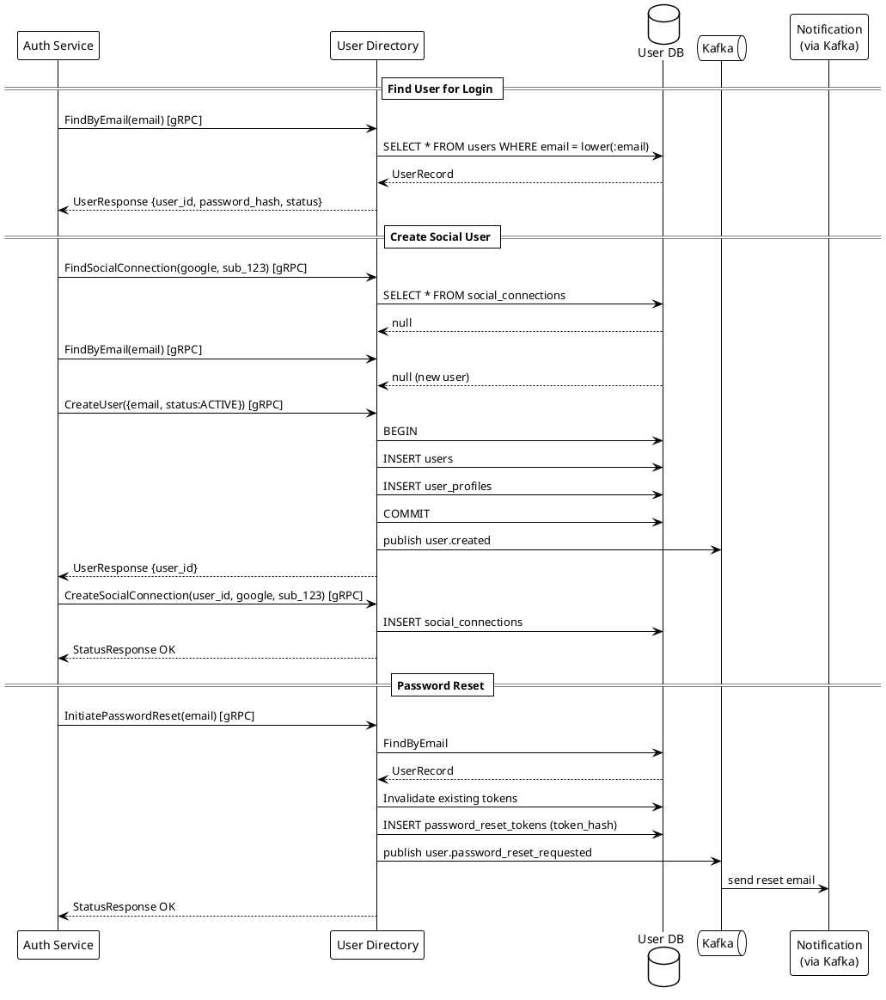

# User Directory Service

---

## What to Implement

The User Directory Service is the single source of truth for all user identity data. It stores user records, password hashes, profile information, account status, and SCIM provisioning endpoints for enterprise integrations. It never handles authentication logic — it only stores and serves identity data. All other services that need user data call this service via gRPC.

---

## Schema

### PostgreSQL — user_directory_db

```sql
-- Core user record
CREATE TABLE users (
    id                  UUID PRIMARY KEY DEFAULT gen_random_uuid(),
    email               VARCHAR(255) UNIQUE,           -- nullable: social-only users may not have email yet
    email_verified      BOOLEAN NOT NULL DEFAULT false,
    email_verified_at   TIMESTAMPTZ,
    phone               VARCHAR(20) UNIQUE,
    phone_verified      BOOLEAN NOT NULL DEFAULT false,
    password_hash       VARCHAR(255),                  -- Argon2id. NULL for social-only users
    status              VARCHAR(20) NOT NULL DEFAULT 'ACTIVE',  -- ACTIVE | SUSPENDED | DELETED | PENDING_VERIFICATION
    created_at          TIMESTAMPTZ NOT NULL DEFAULT NOW(),
    updated_at          TIMESTAMPTZ NOT NULL DEFAULT NOW(),
    deleted_at          TIMESTAMPTZ,                   -- soft delete only
    last_login_at       TIMESTAMPTZ,
    email_required      BOOLEAN NOT NULL DEFAULT false -- true if social-only and email not yet provided
);

CREATE INDEX idx_users_email ON users(email) WHERE email IS NOT NULL;
CREATE INDEX idx_users_phone ON users(phone) WHERE phone IS NOT NULL;
CREATE INDEX idx_users_status ON users(status);

-- User profiles (OIDC claims)
CREATE TABLE user_profiles (
    user_id             UUID PRIMARY KEY REFERENCES users(id) ON DELETE RESTRICT,
    given_name          VARCHAR(100),
    family_name         VARCHAR(100),
    display_name        VARCHAR(200),
    display_name_am     VARCHAR(200),   -- Amharic display name
    picture_url         VARCHAR(500),
    locale              VARCHAR(10) NOT NULL DEFAULT 'en-ET',  -- 'am-ET' | 'en-ET'
    zoneinfo            VARCHAR(50) NOT NULL DEFAULT 'Africa/Addis_Ababa',
    birthdate           DATE,
    gender              VARCHAR(20),
    website             VARCHAR(500),
    updated_at          TIMESTAMPTZ NOT NULL DEFAULT NOW()
);

-- User addresses
CREATE TABLE user_addresses (
    id                  UUID PRIMARY KEY DEFAULT gen_random_uuid(),
    user_id             UUID NOT NULL REFERENCES users(id) ON DELETE RESTRICT,
    formatted           TEXT,
    street_address      VARCHAR(255),
    locality            VARCHAR(100),  -- city
    region              VARCHAR(100),  -- region/state
    postal_code         VARCHAR(20),
    country             VARCHAR(2) NOT NULL DEFAULT 'ET',
    is_primary          BOOLEAN NOT NULL DEFAULT true,
    created_at          TIMESTAMPTZ NOT NULL DEFAULT NOW()
);

-- Email verification tokens
CREATE TABLE email_verifications (
    id                  UUID PRIMARY KEY DEFAULT gen_random_uuid(),
    user_id             UUID NOT NULL REFERENCES users(id),
    token_hash          VARCHAR(64) NOT NULL UNIQUE,
    new_email           VARCHAR(255) NOT NULL,
    created_at          TIMESTAMPTZ NOT NULL DEFAULT NOW(),
    expires_at          TIMESTAMPTZ NOT NULL,
    used_at             TIMESTAMPTZ
);

-- Password reset tokens
CREATE TABLE password_reset_tokens (
    id                  UUID PRIMARY KEY DEFAULT gen_random_uuid(),
    user_id             UUID NOT NULL REFERENCES users(id),
    token_hash          VARCHAR(64) NOT NULL UNIQUE,
    created_at          TIMESTAMPTZ NOT NULL DEFAULT NOW(),
    expires_at          TIMESTAMPTZ NOT NULL,
    used_at             TIMESTAMPTZ,
    ip_requested        INET
);

CREATE INDEX idx_prt_expires ON password_reset_tokens(expires_at);

-- SCIM external IDs (for enterprise provisioning)
CREATE TABLE scim_external_ids (
    id                  UUID PRIMARY KEY DEFAULT gen_random_uuid(),
    user_id             UUID NOT NULL REFERENCES users(id) UNIQUE,
    external_id         VARCHAR(255) NOT NULL,
    tenant_id           VARCHAR(100) NOT NULL,  -- which enterprise tenant
    CONSTRAINT unique_external_per_tenant UNIQUE (external_id, tenant_id)
);

-- Social connections (owned here, used by Authentication Service)
CREATE TABLE social_connections (
    id                  UUID PRIMARY KEY DEFAULT gen_random_uuid(),
    user_id             UUID NOT NULL REFERENCES users(id),
    provider            VARCHAR(30) NOT NULL,
    provider_subject    VARCHAR(255) NOT NULL,
    provider_email      VARCHAR(255),
    connected_at        TIMESTAMPTZ NOT NULL DEFAULT NOW(),
    last_used_at        TIMESTAMPTZ,
    CONSTRAINT unique_provider_subject UNIQUE (provider, provider_subject)
);

CREATE INDEX idx_social_user ON social_connections(user_id);
```

---

## Functionality in Detail

### 1. User Lookup

**FindByEmail(email):** Case-insensitive lookup. Normalize email to lowercase before lookup. Returns full user record including password_hash for authentication.

**FindById(user_id):** Direct UUID lookup.

**FindSocialConnection(provider, provider_subject):** Looks up `social_connections` by (provider, provider_subject) → returns linked user.

### 2. User Creation

**CreateUser(UserDetails):**
1. Normalize email to lowercase
2. Check email uniqueness — if taken → return `EMAIL_ALREADY_EXISTS` error
3. If password provided → do NOT hash here. Caller (Authentication Service) provides pre-hashed value. This service stores the hash only.
4. INSERT `users` + INSERT `user_profiles` in one transaction
5. If email provided → create email verification token, publish event for verification email
6. Return created user record

**CreateSocialConnection(user_id, provider, provider_subject, provider_email):**
1. Verify user exists
2. Check `social_connections` for uniqueness
3. INSERT `social_connections`
4. If user has no verified email + provider_email provided → update user email as unverified, trigger verification

### 3. Account Status Management

**SuspendUser(user_id, reason):**
- UPDATE `users.status = 'SUSPENDED'`
- Does NOT delete anything
- Session Service is notified via Kafka to revoke all sessions

**ReactivateUser(user_id):**
- UPDATE `users.status = 'ACTIVE'`

**DeleteUser(user_id):**
- Soft delete only: UPDATE `users.status = 'DELETED'`, `deleted_at = now`
- Anonymize PII in `user_profiles` (name, picture, address) per PDPP requirement
- Retain `users.id` and `users.created_at` forever (foreign key integrity + audit)
- Retain audit trail in Audit Service (not deleted — required for compliance)
- Publish `user.deleted` Kafka event → Consent Service revokes all consents, Session Service revokes all sessions

### 4. Profile Management

**UpdateProfile(user_id, ProfileFields):**
- Only update provided fields (partial update)
- Validate locale is in allowed set (`am-ET`, `en-ET`)
- UPDATE `user_profiles` + set `updated_at`

**UpdatePassword(user_id, new_password_hash):**
- Caller (Authentication Service) provides Argon2id hash
- UPDATE `users.password_hash`
- Publish `user.password_changed` Kafka event → Session Service revokes all sessions except current

### 5. Email Verification Flow

**InitiateEmailVerification(user_id, email):**
1. Generate `token = base64url(secureRandom(32))`
2. Store `token_hash = SHA256(token)` in `email_verifications` with TTL=24h
3. Publish Kafka event → Notification Service sends verification email

**VerifyEmail(token):**
1. `token_hash = SHA256(token)` → look up in `email_verifications`
2. Validate not expired, not already used
3. Mark `used_at`, update `users.email_verified = true`
4. If email changed (not just verified): UPDATE `users.email` to `new_email`

### 6. Password Reset

**InitiatePasswordReset(email):**
1. Look up user by email — if not found → still return 200 (no user enumeration)
2. Invalidate any existing unexpired reset tokens for this user
3. Generate token, store hash in `password_reset_tokens`
4. Publish Kafka event → Notification Service sends reset email

**ResetPassword(token, new_password_hash):**
1. Look up token by hash
2. Validate not expired, not used
3. Mark `used_at`
4. UPDATE `users.password_hash`
5. Publish `user.password_changed` Kafka event

### 7. SCIM 2.0 Endpoints

For enterprise provisioning (HR system → Tolox IdP user sync).

```
GET    /scim/v2/Users              — list users (paginated, filter support)
GET    /scim/v2/Users/{id}         — get user by SCIM ID
POST   /scim/v2/Users              — provision new user
PUT    /scim/v2/Users/{id}         — replace user
PATCH  /scim/v2/Users/{id}         — update user attributes
DELETE /scim/v2/Users/{id}         — deprovision (soft delete in Tolox)
GET    /scim/v2/ServiceProviderConfig  — SCIM capabilities
GET    /scim/v2/Schemas            — supported schemas
```

SCIM authentication: Bearer token issued per enterprise tenant, validated against `scim_external_ids.tenant_id`.

---

## Interfaces

### Provides (gRPC — inbound from other services)

```protobuf
service UserDirectoryService {
  rpc FindByEmail(FindByEmailRequest) returns (UserResponse);
  rpc FindById(FindByIdRequest) returns (UserResponse);
  rpc FindSocialConnection(SocialLookupRequest) returns (UserResponse);
  rpc CreateUser(CreateUserRequest) returns (UserResponse);
  rpc CreateSocialConnection(SocialConnectionRequest) returns (StatusResponse);
  rpc GetUserProfile(ProfileRequest) returns (ProfileResponse);
  rpc UpdateProfile(UpdateProfileRequest) returns (StatusResponse);
  rpc UpdatePassword(UpdatePasswordRequest) returns (StatusResponse);
  rpc SuspendUser(UserIdRequest) returns (StatusResponse);
  rpc ReactivateUser(UserIdRequest) returns (StatusResponse);
  rpc DeleteUser(UserIdRequest) returns (StatusResponse);
  rpc InitiatePasswordReset(EmailRequest) returns (StatusResponse);
  rpc ResetPassword(ResetPasswordRequest) returns (StatusResponse);
  rpc InitiateEmailVerification(VerificationRequest) returns (StatusResponse);
  rpc VerifyEmail(TokenRequest) returns (StatusResponse);
}
```

### Consumes (Kafka — inbound)

None — User Directory is purely a gRPC-served data store. It publishes events but does not consume them.

### Provides (Kafka — outbound)

| Topic | When |
|---|---|
| `tolox.user.created` | New user created |
| `tolox.user.deleted` | User soft-deleted |
| `tolox.user.suspended` | User suspended |
| `tolox.user.password_changed` | Password updated |
| `tolox.user.email_verification_requested` | Email verification needed |
| `tolox.user.password_reset_requested` | Password reset needed |

### Provides (HTTP — SCIM endpoints)

SCIM endpoints are HTTP REST, protected by Bearer token. Not exposed via gRPC.

---

## Detailed Use Case Flows — Edge Cases

### Edge Case: Duplicate Email on CreateUser

```
1. Two concurrent CreateUser requests with same email
2. Both pass initial uniqueness check at application layer (race condition)
3. DB UNIQUE constraint on users.email catches the second insert
4. Second request gets DB constraint violation
5. Return EMAIL_ALREADY_EXISTS gRPC status
6. Caller handles gracefully
NOTE: Always rely on DB constraint as final arbiter, not application-level check alone
```

### Edge Case: Email Change Verification

```
1. User wants to change email from old@gmail.com to new@gmail.com
2. POST /profile/email/change {new_email: "new@gmail.com"}
3. Check new_email not already taken by another user
4. Create email_verification record for new_email (NOT updating users.email yet)
5. Send verification email to new_email
6. When user clicks verification link:
   - Mark token used
   - UPDATE users.email = new_email
   - UPDATE users.email_verified = true
7. Old email is gone. If verification never completed, email remains old@gmail.com
```

### Edge Case: Password Reset Token Replay

```
1. User requests password reset → token T1 issued
2. User requests again (forgot first email) → token T1 marked invalid, T2 issued
3. Attacker found T1 in old email → submits T1
4. T1 has used_at OR was invalidated when T2 was issued → rejected
5. Only current active reset token is valid
```

### Edge Case: SCIM Deprovisioning

```
1. Enterprise HR system DELETEs user via SCIM
2. User Directory receives SCIM DELETE
3. Soft deletes user, anonymizes PII
4. Publishes user.deleted event
5. Session Service revokes all sessions
6. Consent Service revokes all consents
7. Authorization Service adds active tokens to revocation list
8. User cannot log in anymore
```

---

## Sequence Diagram



---

## Functional Tests & Expected Results

| Test | Action | Expected |
|---|---|---|
| FindByEmail — exists | Look up known email | Returns user record with all fields |
| FindByEmail — not found | Look up unknown email | Returns NOT_FOUND gRPC status |
| FindByEmail — case insensitive | Look up "USER@GMAIL.COM" when stored as "user@gmail.com" | Returns user record |
| CreateUser — duplicate email | Create two users with same email | Second returns EMAIL_ALREADY_EXISTS |
| CreateUser — concurrent duplicate | Two requests simultaneously | DB constraint catches, one succeeds, one gets error |
| Soft delete | DeleteUser(user_id) | status=DELETED, PII fields nulled, user.deleted event published |
| Hard delete attempt | Direct DB delete | Should not be possible — application never issues DELETE SQL |
| SCIM create | POST /scim/v2/Users | User created, scim_external_ids record created |
| SCIM update | PATCH /scim/v2/Users/{id} | Profile updated, only provided fields changed |
| SCIM delete | DELETE /scim/v2/Users/{id} | Soft delete triggered, events published |
| Password reset — unknown email | InitiatePasswordReset(unknown@email.com) | 200 returned (no error leaked) |
| Email verification — valid | VerifyEmail(valid_token) | email_verified=true, token marked used |
| Email verification — expired | Token older than 24h | Returns TOKEN_EXPIRED |
| Email verification — replayed | Submit same token twice | Second returns TOKEN_ALREADY_USED |

---

## Non-Functional Tests

| Test | Tool | Target |
|---|---|---|
| FindByEmail latency | k6 | p99 < 10ms (DB query, index-covered) |
| Concurrent user creation | 100 concurrent CreateUser same email | Exactly 1 succeeds, 99 get EMAIL_ALREADY_EXISTS |
| DB index usage | EXPLAIN ANALYZE on FindByEmail | Uses idx_users_email, no seq scan |
| PII anonymization on delete | Check DB after DeleteUser | name, picture, address fields null, id preserved |
| SCIM pagination | GET /scim/v2/Users?count=10&startIndex=1 | Returns correct page, totalResults accurate |

---

## Unit Tests

```java
// Email normalization
@Test void findByEmail_uppercaseInput_normalizesToLowercase()
@Test void createUser_email_storedAsLowercase()

// Status transitions
@Test void suspendUser_setsStatusSuspended()
@Test void suspendUser_alreadySuspended_isIdempotent()
@Test void deleteUser_softDeleteOnly_retainsId()
@Test void deleteUser_anonymizesPII()
@Test void deleteUser_doesNotDeleteAuditTrail()

// Token management
@Test void passwordResetToken_secondRequest_invalidatesFirst()
@Test void passwordResetToken_expiredToken_rejected()
@Test void emailVerificationToken_usedToken_rejected()

// SCIM mapping
@Test void scimUser_mapsToInternalUser_correctly()
@Test void scimPatch_partialUpdate_onlyModifiesProvidedFields()
@Test void scimDelete_triggersUserDeletion()

// Social connections
@Test void createSocialConnection_duplicateProviderSubject_rejected()
@Test void findSocialConnection_wrongProvider_notFound()
```

---

## Additional Considerations

**PII and PDPP compliance:**
- Amharic names (`display_name_am`) stored alongside Latin names
- All PII columns must be encrypted at rest using column-level encryption (PostgreSQL `pgcrypto` extension or application-layer encryption with key from Vault)
- `deleted_at` + anonymization on soft delete satisfies "right to erasure" under PDPP
- Data export endpoint (GDPR/PDPP-style): `GET /users/{id}/export` returns all stored data as JSON. Implement but gate behind authentication.

**Never store raw passwords.** The User Directory stores only what it receives. Authentication Service is responsible for hashing before calling CreateUser or UpdatePassword. The contract is: User Directory stores hashes, never plaintext, never does hashing itself.

**Email as a lookup key, user_id as the identity.** Every downstream service that caches user data (Consent, Session, etc.) must cache by `user_id`, not by email. Emails change. UUIDs don't.

**Profile GET filtering for OIDC scopes:**
```java
// GetUserProfile must filter by requested scopes
// scope=profile → return name, picture, locale, zoneinfo, updated_at
// scope=email → return email, email_verified
// scope=phone → return phone_number, phone_number_verified
// scope=address → return address object
// Never return password_hash to any caller
```
